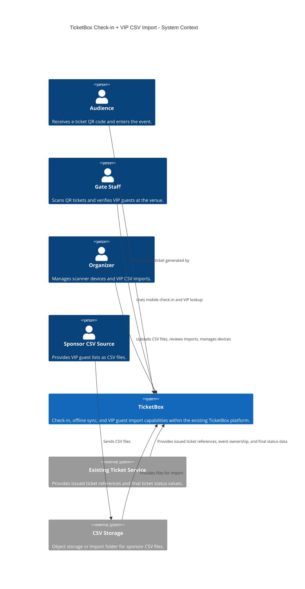
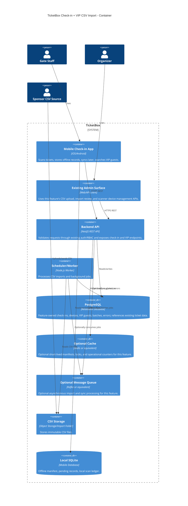
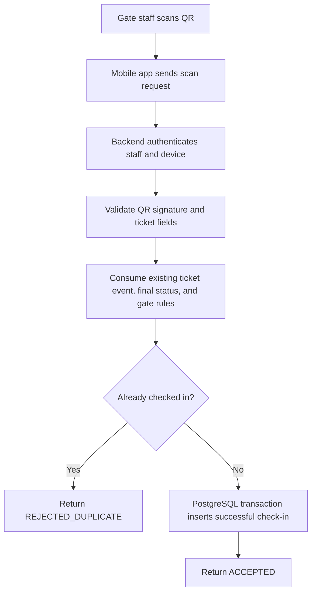
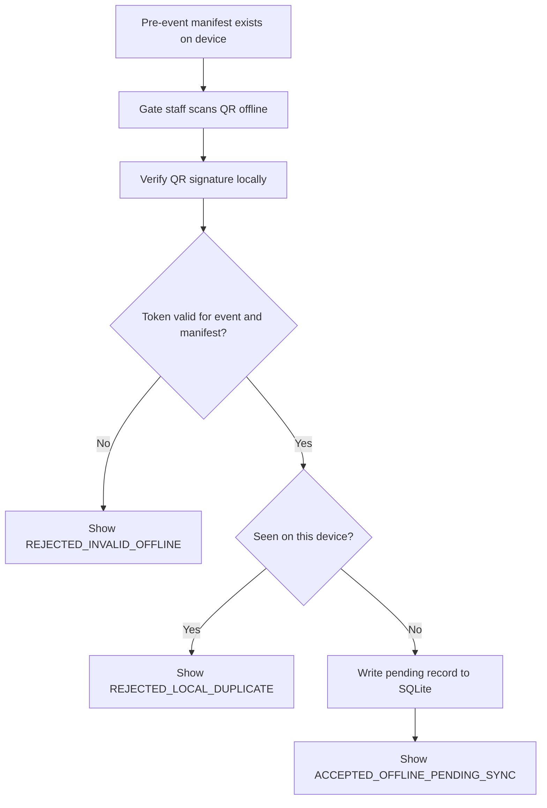
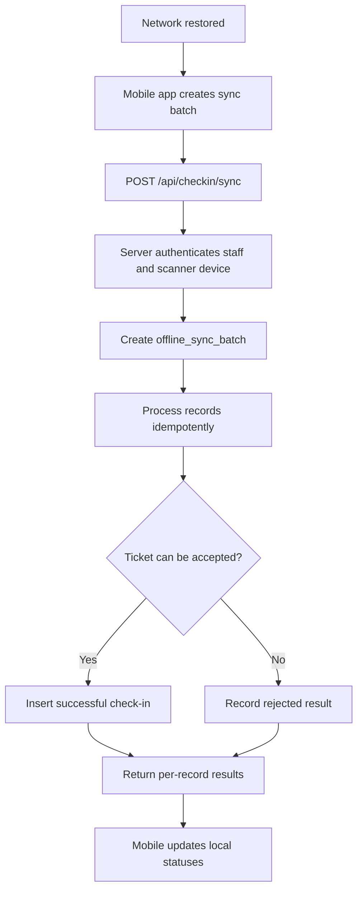
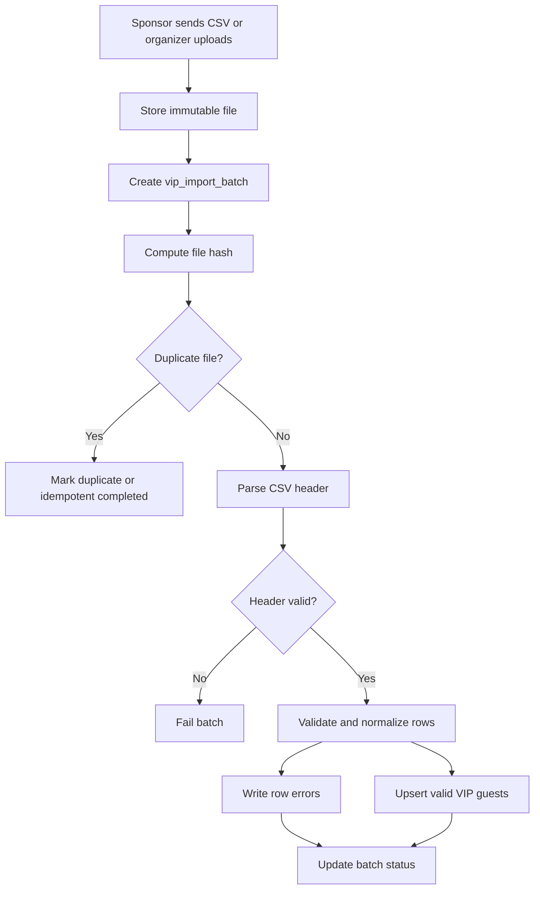
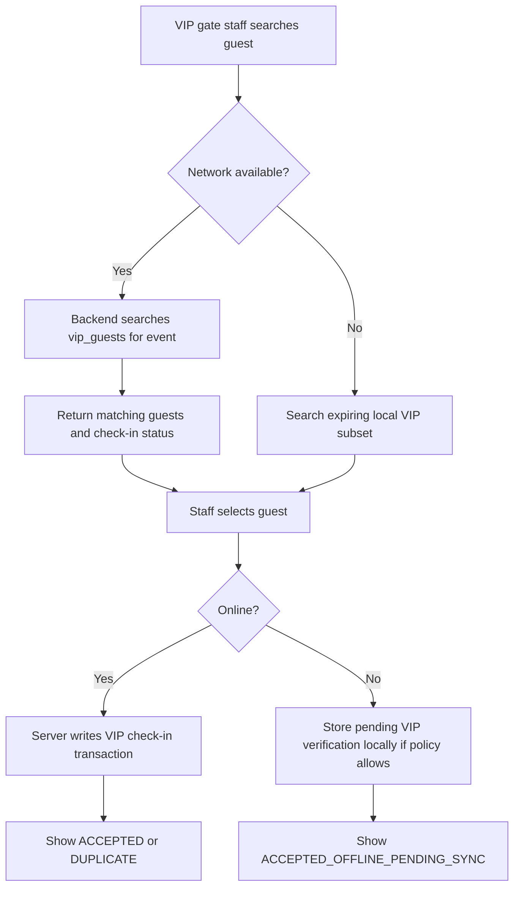

# Technical Design: Check-in + VIP CSV Import

## 1. Overall Architecture

### Components

- **Mobile Check-in App**: Used by gate staff to scan audience QR tickets, search VIP guests, perform VIP check-in, download offline manifests, store pending offline records, and sync them later.
- **Backend API**: REST API entrypoint for scan validation, offline sync, manifest download, scanner registration, VIP import upload, VIP search, and admin import review.
- **Existing Auth/RBAC Middleware**: Existing platform capability that validates staff identity, role assignment, organizer authorization, device credentials, event assignment, and endpoint-level permissions required by this feature.
- **Existing Ticket Service**: Existing platform dependency that provides issued ticket references, event ownership, QR token metadata, and final ticket status values such as `ACTIVE`, `CANCELLED`, `REFUNDED`, and `VOIDED`.
- **Feature Database Tables**: PostgreSQL tables owned by this feature for check-in records, scanner devices, offline sync batches, VIP guests, VIP import batches, VIP import errors, and audit data. Ticket fields shown below are consumed references to existing ticket data.
- **Check-in Service**: Owns server-side ticket validation and transactional check-in writes.
- **Offline Sync Service**: Processes batches of offline records idempotently and returns per-record reconciliation results.
- **VIP Import Service**: Parses CSV files, validates headers and rows, normalizes identities, detects duplicates, and upserts valid VIP guests.
- **Scheduler/Worker**: Polls object storage/import folders, starts background imports, retries failed retryable work, and emits operational metrics.
- **Object Storage or Import Folder**: Stores sponsor CSV files and admin uploads. Files are immutable once submitted.
- **Optional Cache**: Optional feature-local supporting infrastructure for short-lived manifests, locks, and operational counters. This is not a global traffic or caching strategy.
- **Optional Message Queue**: Optional feature-local supporting infrastructure for import jobs or large sync processing. This is not required for the first implementation and does not define the platform-wide message-broker strategy.
- **Local Mobile Database**: SQLite database on each scanner device storing offline manifest metadata, local scan ledger, VIP subset cache, pending sync records, and sync result history.
- **Monitoring/Logging**: Structured logs, metrics, and alerts for scan latency, sync backlog, import failures, row error rates, duplicate detections, and stale offline devices.

### Dependencies vs Owned Scope

This design owns only feature cluster #4 implementation concerns: online ticket check-in, offline ticket check-in, offline sync/reconciliation, scanner device authorization within check-in, VIP CSV import, VIP guest lookup/check-in, and related audit/import/check-in records.

It consumes existing platform services for event records, issued tickets, final ticket status, user identity, role assignment, organizer authorization, and staff authentication. This feature does not create concerts/events, create tickets, sell tickets, perform financial transaction handling, change refund state, or define a global RBAC framework. Admin web UI details are out of scope; the design defines admin-facing capabilities and APIs for CSV upload, import review, and scanner device management.

### Communication

1. Gate staff authenticate in the mobile app and register or activate a scanner device.
2. Before the event, the mobile app downloads an offline manifest from the Backend API.
3. Online scans call the Check-in Service through the Backend API and write directly to PostgreSQL in a transaction.
4. Offline scans are verified locally and written to SQLite as pending records.
5. When connectivity returns, the app sends pending records to the Offline Sync Service. The server reconciles each record against PostgreSQL and returns per-record status.
6. Sponsors place CSV files into storage, or organizers upload CSV files through an existing admin surface.
7. The Scheduler/Worker creates import batches and invokes the VIP Import Service.
8. Valid VIP rows are upserted into PostgreSQL. Invalid rows are written to `vip_import_errors`.
9. VIP gate staff search VIP guests through the Backend API when online and may use an expiring local VIP subset cache when offline.

## 2. C4 Diagrams

### C4 Level 1 - System Context



### C4 Level 2 - Container



## 3. High-level Architecture Diagrams

### Online Check-in



### Offline Check-in



### Offline Sync



### VIP CSV Import



### VIP Guest Lookup and Check-in



## 4. Database Design

PostgreSQL is the primary database because this feature requires transactions, uniqueness constraints, row-level auditability, and reliable reconciliation.

### `tickets`

The `tickets` structure below represents existing ticket data consumed by this feature, not data owned or created by this feature. Check-in reads ticket identity, event association, QR metadata, zone information, and final status. It does not create tickets, sell tickets, perform financial transaction handling, change refund state, or mutate ticket lifecycle status.

| Field | Type | Notes |
| --- | --- | --- |
| `id` | `uuid` | Existing ticket primary key reference. |
| `event_id` | `uuid` | Existing event reference associated with the ticket. |
| `order_id` | `uuid` | Existing order reference, read-only for this feature. |
| `audience_user_id` | `uuid` | Existing audience/user reference, read-only and nullable. |
| `ticket_code_hash` | `text` | Existing hash of QR token identifier or ticket code. |
| `qr_key_id` | `text` | Existing signing key identifier used by QR token. |
| `ticket_type` | `text` | Existing ticket classification such as general admission or seated. |
| `zone_id` | `uuid` | Existing zone/gate partition reference, nullable. |
| `seat_label` | `text` | Nullable. |
| `status` | `text` | Existing final ticket status consumed by check-in: `ACTIVE`, `CANCELLED`, `REFUNDED`, `VOIDED`. |
| `issued_at` | `timestamptz` | Existing ticket issue time. |
| `updated_at` | `timestamptz` | Existing last ticket update time. |

- Primary key: `tickets(id)`.
- Unique constraints: `unique(event_id, ticket_code_hash)`.
- Indexes: `(event_id, status)`, `(event_id, zone_id)`, `(audience_user_id)`.

### `check_in_records`

| Field | Type | Notes |
| --- | --- | --- |
| `id` | `uuid` | Primary key. |
| `event_id` | `uuid` | Event checked into. |
| `ticket_id` | `uuid` | Nullable for invalid QR attempts if stored for audit. |
| `scanner_device_id` | `uuid` | Device submitting the record. |
| `gate_id` | `uuid` | Nullable gate assignment. |
| `staff_user_id` | `uuid` | Staff who scanned. |
| `idempotency_key` | `text` | Client-generated key per scan attempt. |
| `source` | `text` | `ONLINE`, `OFFLINE_SYNC`, `VIP_ONLINE`, `VIP_OFFLINE_SYNC`. |
| `status` | `text` | `ACCEPTED`, `REJECTED_DUPLICATE`, `REJECTED_INVALID`, `REJECTED_WRONG_EVENT`, `REJECTED_UNAUTHORIZED_DEVICE`, `SYNC_CONFLICT`. |
| `scanned_at` | `timestamptz` | Device scan time. |
| `received_at` | `timestamptz` | Server receive time. |
| `offline_record_id` | `text` | Device-local record id, nullable for online scans. |
| `qr_token_hash` | `text` | Hash for audit without storing raw QR. |
| `rejection_reason` | `text` | Nullable detail. |
| `metadata` | `jsonb` | App version, manifest version, network state, etc. |

- Primary key: `check_in_records(id)`.
- Foreign keys: `ticket_id -> tickets(id)`, `scanner_device_id -> scanner_devices(id)`.
- Unique constraints: `unique(scanner_device_id, idempotency_key)`, `unique(scanner_device_id, offline_record_id)` where `offline_record_id is not null`.
- Single successful ticket check-in: partial unique index `unique(ticket_id) where status = 'ACCEPTED' and ticket_id is not null`.
- Indexes: `(event_id, scanned_at)`, `(event_id, status)`, `(ticket_id)`, `(scanner_device_id, received_at)`.

### `scanner_devices`

| Field | Type | Notes |
| --- | --- | --- |
| `id` | `uuid` | Primary key. |
| `device_public_id` | `text` | Stable non-secret device identifier. |
| `event_id` | `uuid` | Assigned event. |
| `gate_id` | `uuid` | Assigned gate, nullable. |
| `zone_id` | `uuid` | Assigned zone, nullable. |
| `registered_by_user_id` | `uuid` | Organizer or admin who registered the device. |
| `assigned_staff_user_id` | `uuid` | Nullable. |
| `status` | `text` | `ACTIVE`, `SUSPENDED`, `REVOKED`, `LOST`. |
| `last_seen_at` | `timestamptz` | Last API contact. |
| `manifest_version` | `text` | Last downloaded manifest version. |
| `created_at` | `timestamptz` | Registration time. |

- Primary key: `scanner_devices(id)`.
- Unique constraints: `unique(device_public_id)`.
- Indexes: `(event_id, status)`, `(event_id, gate_id)`, `(assigned_staff_user_id)`.

### `offline_sync_batches`

| Field | Type | Notes |
| --- | --- | --- |
| `id` | `uuid` | Primary key. |
| `event_id` | `uuid` | Event being synced. |
| `scanner_device_id` | `uuid` | Device submitting records. |
| `staff_user_id` | `uuid` | Staff submitting sync. |
| `batch_idempotency_key` | `text` | Client-generated batch key. |
| `status` | `text` | `RECEIVED`, `PROCESSING`, `COMPLETED`, `COMPLETED_WITH_CONFLICTS`, `FAILED`. |
| `record_count` | `integer` | Submitted count. |
| `accepted_count` | `integer` | Accepted count. |
| `rejected_count` | `integer` | Rejected count. |
| `retryable_count` | `integer` | Retryable failure count. |
| `first_scanned_at` | `timestamptz` | Earliest record time. |
| `last_scanned_at` | `timestamptz` | Latest record time. |
| `created_at` | `timestamptz` | Batch creation time. |
| `completed_at` | `timestamptz` | Nullable. |

- Primary key: `offline_sync_batches(id)`.
- Foreign keys: `scanner_device_id -> scanner_devices(id)`.
- Unique constraints: `unique(scanner_device_id, batch_idempotency_key)`.
- Indexes: `(event_id, created_at)`, `(scanner_device_id, status)`.

### `vip_guests`

| Field | Type | Notes |
| --- | --- | --- |
| `id` | `uuid` | Primary key. |
| `event_id` | `uuid` | Event guest belongs to. |
| `external_guest_id` | `text` | Sponsor-provided id, nullable. |
| `full_name` | `text` | Required. |
| `normalized_email` | `text` | Nullable lowercase normalized email. |
| `normalized_phone` | `text` | Nullable E.164 or project-standard phone format. |
| `company` | `text` | Nullable. |
| `tier` | `text` | `VIP`, `SVIP`, `SPONSOR`, `MEDIA`. |
| `invitation_code_hash` | `text` | Hash of invitation code if present. |
| `source_batch_id` | `uuid` | Last import batch that created or updated the row. |
| `status` | `text` | `ACTIVE`, `REMOVED`, `CHECKED_IN`. |
| `checked_in_at` | `timestamptz` | Nullable. |
| `checked_in_by_device_id` | `uuid` | Nullable. |
| `created_at` | `timestamptz` | Created time. |
| `updated_at` | `timestamptz` | Updated time. |

- Primary key: `vip_guests(id)`.
- Foreign keys: `source_batch_id -> vip_import_batches(id)`, `checked_in_by_device_id -> scanner_devices(id)`.
- Unique constraints:
  - `unique(event_id, external_guest_id)` where `external_guest_id is not null`.
  - `unique(event_id, normalized_email)` where `external_guest_id is null and normalized_email is not null`.
  - `unique(event_id, normalized_phone)` where `external_guest_id is null and normalized_email is null and normalized_phone is not null`.
- Indexes: `(event_id, tier)`, `(event_id, status)`, trigram or full-text index on `full_name`, `(event_id, normalized_phone)`.

### `vip_import_batches`

| Field | Type | Notes |
| --- | --- | --- |
| `id` | `uuid` | Primary key. |
| `event_id` | `uuid` | Target event. |
| `source_type` | `text` | `ADMIN_UPLOAD`, `SCHEDULED_STORAGE`. |
| `file_name` | `text` | Original file name. |
| `storage_uri` | `text` | Immutable file location. |
| `file_hash` | `text` | SHA-256 file hash. |
| `status` | `text` | `PENDING`, `PROCESSING`, `COMPLETED`, `COMPLETED_WITH_ERRORS`, `FAILED`. |
| `total_rows` | `integer` | Parsed data rows. |
| `valid_rows` | `integer` | Valid rows. |
| `invalid_rows` | `integer` | Invalid rows. |
| `inserted_count` | `integer` | New guests. |
| `updated_count` | `integer` | Existing guests updated. |
| `skipped_count` | `integer` | Duplicate/no-op rows. |
| `error_summary` | `jsonb` | Header and aggregate error details. |
| `created_by_user_id` | `uuid` | Organizer/admin for uploads, nullable for scheduler. |
| `created_at` | `timestamptz` | Created time. |
| `started_at` | `timestamptz` | Nullable. |
| `completed_at` | `timestamptz` | Nullable. |

- Primary key: `vip_import_batches(id)`.
- Unique constraints: `unique(event_id, file_hash)`.
- Indexes: `(event_id, created_at)`, `(event_id, status)`.

### `vip_import_errors`

| Field | Type | Notes |
| --- | --- | --- |
| `id` | `uuid` | Primary key. |
| `batch_id` | `uuid` | Import batch. |
| `event_id` | `uuid` | Denormalized for filtering. |
| `row_number` | `integer` | CSV row number, including header offset. |
| `field_name` | `text` | Nullable for row-level errors. |
| `error_code` | `text` | `MISSING_REQUIRED_FIELD`, `INVALID_TIER`, `INVALID_EVENT`, `DUPLICATE_ROW`, etc. |
| `error_message` | `text` | Human-readable detail. |
| `raw_row` | `jsonb` | Original row data after parsing. |
| `created_at` | `timestamptz` | Created time. |

- Primary key: `vip_import_errors(id)`.
- Foreign keys: `batch_id -> vip_import_batches(id)`.
- Unique constraints: none required, but duplicate suppression can use `unique(batch_id, row_number, error_code, field_name)`.
- Indexes: `(batch_id, row_number)`, `(event_id, created_at)`, `(error_code)`.

## 5. Offline Check-in Design

### Offline Manifest

Before the event, each authorized scanner downloads an offline manifest containing:

- Event metadata: `event_id`, event name, venue, event date, timezone, manifest version, expiry time.
- Valid ticket reference data, or public keys and token rules sufficient for offline QR verification.
- Gate and zone assignment, including allowed ticket zones for the device.
- Optional VIP guest subset for assigned VIP gates.
- Revocation deltas for cancelled/refunded/voided tickets if the manifest contains ticket references.
- Signature metadata so the app can verify manifest integrity.

The manifest should be scoped per event and preferably per gate or zone. Broad all-event manifests increase offline usefulness but also increase device data sensitivity and stale-data risk.

### QR Design

QR codes should contain compact signed tokens. A token should include a ticket identifier or opaque ticket code, event id, issue timestamp, expiry or event date constraints, and key id. The token must be signed by TicketBox using an asymmetric key so scanner apps can verify the signature offline using public keys.

The QR payload must not expose sensitive data such as buyer name, phone number, email, or raw database identifiers in plaintext. The app should store and transmit token hashes for audit instead of storing raw QR data where possible.

### Online Flow

1. The app scans a QR code.
2. The app sends `POST /api/checkin/scan` with the QR token, scanner device id, event id, gate id, scan timestamp, and `idempotency_key`.
3. Existing Auth/RBAC validates the staff token, device status, event assignment, and gate permission.
4. The Check-in Service verifies the QR signature and extracts the ticket reference.
5. The server consumes existing ticket data to validate ticket existence, event match, final ticket status, ownership/transfer state if exposed by the ticket service, and gate/zone rules.
6. A PostgreSQL transaction inserts an `ACCEPTED` check-in record if no successful check-in exists for the ticket.
7. The partial unique index on successful `ticket_id` check-ins prevents race-condition duplicates.
8. The API returns `ACCEPTED` or a rejection result.

### Offline Flow

1. The app detects network unavailability or request timeout.
2. The app verifies the QR signature locally using the manifest public key.
3. The app validates event id, token expiry/event date, manifest expiry, and gate/zone rules available locally.
4. The app checks the local SQLite scan ledger for the same ticket token hash.
5. If locally valid and unseen on the device, the app writes a local record with status `PENDING_SYNC` before displaying success.
6. The app displays `ACCEPTED_OFFLINE_PENDING_SYNC`.

### Sync Flow

1. When network returns, the app sends pending records using `POST /api/checkin/sync`.
2. The request includes a `batch_idempotency_key`, device id, event id, manifest version, and scan records with per-record `idempotency_key`.
3. The Offline Sync Service creates or reuses an `offline_sync_batch`.
4. The server processes each record idempotently.
5. Accepted records are inserted with source `OFFLINE_SYNC`.
6. Duplicate, invalid, wrong-event, unauthorized, and conflict records receive per-record rejection results.
7. The app updates local record status to:
   - `SYNCED_ACCEPTED`
   - `SYNCED_REJECTED_DUPLICATE`
   - `SYNCED_REJECTED_INVALID`
   - `SYNC_FAILED_RETRYABLE`

### Offline Double-entry Trade-off

If multiple gates are offline at the same time, TicketBox cannot absolutely prevent the same valid ticket from being accepted by multiple offline devices in real time. Only the backend has global state. The server detects conflicts when devices sync and accepts the first valid successful check-in according to server reconciliation policy, then rejects later conflicting records as `SYNC_CONFLICT` or `SYNCED_REJECTED_DUPLICATE`.

Risk reduction measures:

- Gate/zone partitioning so each scanner only accepts tickets for assigned zones.
- Gate-specific offline manifests to limit valid ticket scope.
- Offline time-window limits, such as requiring fresh manifests within a configured number of hours.
- Warnings and supervisor escalation when a device has been offline too long.
- Local duplicate detection per device.
- Frequent sync attempts when intermittent connectivity exists.
- Post-event audit logs showing conflicting scans, device ids, staff ids, gates, and timestamps.

## 6. VIP CSV Import Design

### Import Pipeline

1. Sponsor sends CSV to storage, or organizer uploads CSV through an existing admin surface.
2. The file is stored immutably in object storage or an import folder.
3. Scheduler/worker detects the file, or the admin upload endpoint starts or optionally publishes an import job.
4. The VIP Import Service creates a `vip_import_batch` with status `PENDING`.
5. The worker computes `file_hash` and checks `unique(event_id, file_hash)`.
6. The batch moves to `PROCESSING`.
7. The parser reads the CSV header and validates exact required columns.
8. If the header is invalid, the batch status becomes `FAILED`.
9. Rows are parsed, normalized, and validated.
10. Invalid rows are written to `vip_import_errors`.
11. Valid rows are deduplicated within the file.
12. Valid unique guests are upserted into `vip_guests` in safe batches.
13. Batch counters are updated.
14. Final status becomes `COMPLETED`, `COMPLETED_WITH_ERRORS`, or `FAILED`.

### Expected CSV Columns

```csv
external_guest_id,full_name,email,phone,company,tier,event_id,invitation_code
```

### Validation Rules

- `full_name` is required.
- At least one of `email`, `phone`, or `external_guest_id` must be present.
- `tier` must be one of `VIP`, `SVIP`, `SPONSOR`, `MEDIA`.
- `event_id` must exist and must match the import target event for admin uploads.
- Email must be trimmed, lowercased, and validated.
- Phone must be normalized to the project standard, preferably E.164 for Vietnam-capable numbers.
- Duplicates inside the same file must be detected.
- Duplicates against existing records must be handled by upsert or skip policy.

### Deduplication and Upsert Policy

Identity priority:

1. `event_id + external_guest_id`
2. `event_id + normalized_email`
3. `event_id + normalized_phone`

When `external_guest_id` exists, it is authoritative. If it is missing, email is preferred over phone because phone formatting can be less stable across sponsor files. For an existing guest, later imports update mutable fields such as full name, company, tier, invitation code hash, and source batch. The import must not erase a checked-in guest's check-in audit fields.

### Import Failure Isolation

Invalid files and job failures must not interrupt check-in or VIP lookup APIs. Workers process imports separately from user-facing requests. Partial row errors are visible to organizers. Database writes should use bounded transactions per batch segment so one bad row does not abort the entire import.

## 7. Feature Permissions Using Existing RBAC

TicketBox is assumed to already have authentication, user roles, event ownership, and authorization middleware. This feature does not design or implement the global RBAC framework. It defines only the permissions needed for check-in, offline sync, scanner devices, VIP guest lookup/check-in, and VIP CSV import.

### Roles

- `GATE_STAFF`: Uses the mobile app, scans tickets, syncs offline records, searches VIP guests for assigned events, and performs VIP check-in.
- `ORGANIZER`: Views import batches, uploads CSV files, views import errors, manages scanner devices, and reviews check-in records for owned events.
- `ADMIN`: Full access across events, devices, imports, and audit records.
- `AUDIENCE`: Cannot access check-in, admin, or VIP import APIs.

### Enforcement

- API endpoints enforce role and event scope through the existing Auth/RBAC middleware before controller logic.
- Mobile app hides unauthorized features but does not rely on client-side checks for security.
- Existing admin surfaces hide or disable organizer/admin feature entry points based on role and event ownership.
- Scanner device credentials are validated in addition to staff identity.
- Gate staff access is constrained to assigned events and optionally assigned gates/zones.

## 8. API Design

### `POST /api/checkin/scan`

- Role: `GATE_STAFF`.
- Request: `eventId`, `scannerDeviceId`, `gateId`, `qrToken`, `scannedAt`, `idempotencyKey`, optional `appVersion`, `manifestVersion`.
- Response: `result` (`ACCEPTED`, `REJECTED_DUPLICATE`, `REJECTED_INVALID`, `REJECTED_WRONG_EVENT`, `REJECTED_CANCELLED`, `REJECTED_UNAUTHORIZED_DEVICE`), `ticketId` when allowed, `message`, `serverTime`.
- Error cases: invalid auth, unauthorized device, malformed QR, wrong event, cancelled/refunded ticket, duplicate ticket, database unavailable.

### `POST /api/checkin/sync`

- Role: `GATE_STAFF`.
- Request: `eventId`, `scannerDeviceId`, `batchIdempotencyKey`, `manifestVersion`, `records[]` with `offlineRecordId`, `idempotencyKey`, `qrToken` or `qrTokenHash + signedPayload`, `scannedAt`, `gateId`.
- Response: `batchId`, `status`, `results[]` with `offlineRecordId`, `result`, `checkInRecordId`, `retryable`, `message`.
- Error cases: unauthorized device, stale manifest policy violation, invalid batch shape, duplicate batch, partial retryable database failure, sync conflict.

### `GET /api/events/{eventId}/offline-manifest`

- Role: `GATE_STAFF`.
- Query: optional `scannerDeviceId`, `gateId`, `manifestVersion`.
- Response: manifest metadata, public keys, event/gate rules, ticket reference data or verification rules, optional VIP subset, expiry, signature.
- Error cases: unauthorized event, revoked device, manifest unavailable, manifest not ready.

### `POST /api/scanner-devices/register`

- Role: `ORGANIZER` or `ADMIN`.
- Request: `eventId`, `devicePublicId`, optional `gateId`, `zoneId`, `assignedStaffUserId`, device label.
- Response: `scannerDeviceId`, `status`, assignment details, registration timestamp.
- Error cases: duplicate device, invalid event, unauthorized organizer, invalid gate assignment.

### `GET /api/checkin/records?eventId=...`

- Role: `ORGANIZER` or `ADMIN`.
- Query: `eventId`, optional `status`, `gateId`, `scannerDeviceId`, `from`, `to`, pagination.
- Response: paginated check-in records and aggregate counts.
- Error cases: unauthorized event, invalid filters.

### `POST /api/admin/events/{eventId}/vip-imports`

- Role: `ORGANIZER` or `ADMIN`.
- Request: multipart CSV file or JSON with `storageUri`, optional `importMode`.
- Response: `batchId`, `status`, `fileName`, `fileHash` if already computed.
- Error cases: missing file, unsupported content type, file too large, unauthorized event, duplicate file.

### `GET /api/admin/events/{eventId}/vip-imports`

- Role: `ORGANIZER` or `ADMIN`.
- Query: `status`, `from`, `to`, pagination.
- Response: paginated import batches with counters and statuses.
- Error cases: unauthorized event, invalid filters.

### `GET /api/admin/vip-imports/{batchId}`

- Role: `ORGANIZER` or `ADMIN`.
- Response: batch details, counters, status, file metadata, timestamps, error summary.
- Error cases: batch not found, unauthorized event.

### `GET /api/admin/vip-imports/{batchId}/errors`

- Role: `ORGANIZER` or `ADMIN`.
- Query: `errorCode`, pagination.
- Response: paginated row errors with row number, field, code, message, and raw row.
- Error cases: batch not found, unauthorized event.

### `GET /api/checkin/events/{eventId}/vip-guests/search`

- Role: `GATE_STAFF`.
- Query: `q`, optional `tier`, `status`, pagination.
- Response: matching VIP guests with masked email/phone where appropriate, tier, company, and check-in status.
- Error cases: unauthorized event, query too short, rate limit.

### `POST /api/checkin/events/{eventId}/vip-guests/{guestId}/checkin`

- Role: `GATE_STAFF`.
- Request: `scannerDeviceId`, `gateId`, `idempotencyKey`, `checkedInAt`.
- Response: `result` (`ACCEPTED`, `REJECTED_DUPLICATE`, `REJECTED_NOT_FOUND`, `REJECTED_UNAUTHORIZED_DEVICE`), `guestId`, `checkedInAt`.
- Error cases: guest not found, already checked in, unauthorized device, wrong event, database unavailable.

## 9. Error Handling

### Check-in Errors

- Invalid QR: return `REJECTED_INVALID`; store audit attempt with QR token hash when possible.
- Ticket not found: return `REJECTED_INVALID` or `REJECTED_NOT_FOUND` depending on staff-facing policy.
- Ticket cancelled/refunded: return `REJECTED_CANCELLED` with clear app message.
- Ticket already checked in: return `REJECTED_DUPLICATE` and include prior check-in time if policy allows.
- Wrong event: return `REJECTED_WRONG_EVENT`.
- Scanner device not authorized: return `REJECTED_UNAUTHORIZED_DEVICE` or HTTP `403`.
- Server unavailable: mobile app enters offline path if manifest permits; otherwise show retry.
- Offline manifest expired: reject offline acceptance and require supervisor/network refresh.
- Sync conflict: mark server result as duplicate/conflict and update local status to rejected.

### VIP Import Errors

- Missing file: reject upload or mark scheduled batch `FAILED`.
- Invalid CSV header: fail whole batch and store header error summary.
- Invalid row: store row-level error and continue valid rows.
- Duplicate row: record skip/error according to policy and avoid duplicate guest creation.
- Import job crash: mark batch `FAILED` or leave heartbeat for worker recovery; rerun idempotently.
- Database temporarily unavailable: retry with backoff; keep batch `PROCESSING` or `FAILED` after retry limit.
- Sponsor uploads same file again: detect with `event_id + file_hash` and return existing batch or no-op status.
- Partial import: final status `COMPLETED_WITH_ERRORS` with exact counters and row errors.

## 10. Acceptance Criteria

- Given a valid unused QR and the network is online, when gate staff scans it, then the server marks the ticket as checked in exactly once.
- Given two online scan requests for the same ticket arrive concurrently, when both are processed, then only one successful check-in record exists.
- Given a ticket has already been checked in, when it is scanned again, then the app shows a duplicate rejection.
- Given the app is offline and has a valid unexpired manifest, when a valid QR is scanned, then the record is stored in SQLite and marked `PENDING_SYNC`.
- Given the app is offline and scans the same ticket twice on the same device, then the second scan is rejected locally.
- Given the network is restored, when pending records are synced, then accepted records are persisted on the server and duplicates are rejected per record.
- Given multiple offline devices accepted the same ticket, when sync completes, then the backend accepts only one record and marks the others as conflicts or duplicates.
- Given a scanner device is revoked, when it attempts scan or sync, then the API rejects the request.
- Given a CSV file has 100 valid rows and 3 invalid rows, when import runs, then 100 guests are imported or upserted and 3 row errors are stored.
- Given the CSV header is invalid, when import runs, then no guest rows are imported and the batch is marked `FAILED`.
- Given the same CSV file is imported twice for the same event, when the second import runs, then it is detected as a duplicate or processed idempotently without creating duplicate guests.
- Given the same guest appears multiple times, when import runs, then the import uses `external_guest_id` first and normalized email/phone fallback to prevent duplicate guest records.
- Given VIP gate staff searches online for an active guest assigned to the event, then the API returns the guest and current check-in status.
- Given a VIP guest is already checked in, when another VIP check-in request is submitted, then the backend rejects it as duplicate.
