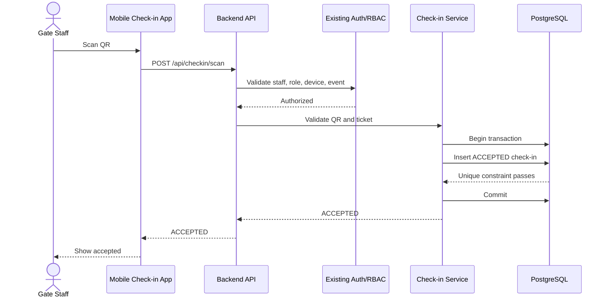
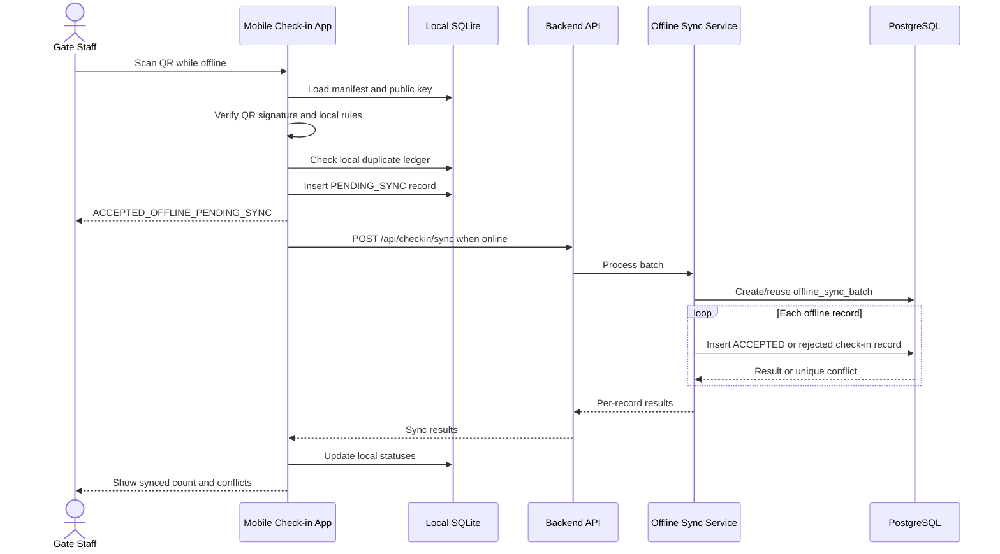

# Specification: Offline Event Check-in

## Description

The check-in capability allows gate staff to validate audience e-ticket QR codes and record event entry. It supports online server validation and offline temporary acceptance using locally verifiable signed QR tokens and a preloaded offline manifest. The backend remains the final source of truth and reconciles offline records during sync.

## Actors

- **Gate Staff**: Scans audience QR tickets and syncs pending offline records.
- **Organizer**: Registers scanner devices, assigns gates/zones, and reviews check-in records.
- **Admin**: Has full operational access.
- **Audience**: Presents QR ticket at the venue.
- **Backend API**: Validates online scans, serves manifests, and processes sync batches.
- **Mobile Check-in App**: Performs scans, local validation, local persistence, and sync.

## Preconditions

- The ticket exists in the existing ticket service and has final status `ACTIVE`.
- Gate staff is authenticated and assigned to the event.
- Scanner device is registered, active, and assigned to the event.
- For offline mode, the device has downloaded an unexpired offline manifest.
- QR tokens are signed and can be verified with the public keys in the manifest.
- Device local time is sufficiently accurate or bounded by manifest tolerance rules.

## Main Flow: Online Check-in

1. Gate staff scans the audience QR code.
2. The mobile app sends `POST /api/checkin/scan` with the QR token, event id, scanner device id, gate id, scan timestamp, and idempotency key.
3. Backend checks the existing auth/RBAC platform for the staff token, role `GATE_STAFF`, event assignment, and scanner device status.
4. The Check-in Service verifies the QR signature and extracts the ticket reference.
5. The service consumes existing ticket data to validate that the ticket exists, belongs to the event, has final status `ACTIVE`, and is allowed at the assigned gate/zone.
6. The service starts a PostgreSQL transaction.
7. The service inserts an `ACCEPTED` `check_in_records` row.
8. The database partial unique index on successful `ticket_id` check-ins prevents a second successful check-in.
9. The transaction commits.
10. The API returns `ACCEPTED` with the server timestamp and check-in record id.

## Main Flow: Offline Check-in

1. The app detects that the backend is unreachable or the scan request times out.
2. The app loads the current offline manifest from SQLite.
3. The app verifies the manifest signature and expiry.
4. The app verifies the QR token signature using the manifest public key.
5. The app checks event id, token validity window, gate/zone rules, and any cached revocation data.
6. The app checks its local scan ledger for an existing local record with the same ticket token hash.
7. If the scan is locally valid and not previously seen on the device, the app writes a local record with status `PENDING_SYNC`.
8. The app displays `ACCEPTED_OFFLINE_PENDING_SYNC`.
9. The app increments the unsynced-record count and retries sync in the background when connectivity returns.

## Main Flow: Offline Sync

1. The mobile app detects restored connectivity.
2. The app reads records with status `PENDING_SYNC` or `SYNC_FAILED_RETRYABLE`.
3. The app sends `POST /api/checkin/sync` with a batch idempotency key and pending records.
4. The Backend API authenticates staff and scanner device credentials.
5. The Offline Sync Service creates or reuses an `offline_sync_batches` row using `scanner_device_id + batch_idempotency_key`.
6. For each record, the server verifies the QR token or signed payload, event, device assignment, and idempotency key.
7. For each valid unused ticket, the server inserts an `ACCEPTED` check-in record in a transaction.
8. For duplicate, invalid, wrong-event, cancelled, unauthorized, or conflicted records, the server stores a rejected audit result.
9. The API returns one result per submitted offline record.
10. The app updates each local record to `SYNCED_ACCEPTED`, `SYNCED_REJECTED_DUPLICATE`, `SYNCED_REJECTED_INVALID`, or `SYNC_FAILED_RETRYABLE`.

## Error Scenarios

- **Invalid QR**: Online requests return `REJECTED_INVALID`; offline scans show invalid and do not create pending records unless audit-only local logging is enabled.
- **Ticket not found**: Server returns rejected result and stores an audit attempt.
- **Cancelled, refunded, or voided ticket**: Server consumes the existing final ticket status and returns `REJECTED_CANCELLED`; offline app can only detect this if manifest revocation data is fresh.
- **Already checked in**: Server returns `REJECTED_DUPLICATE`; local offline duplicate detection catches duplicates only on the same device.
- **Wrong event**: QR event id does not match the selected event and is rejected.
- **Unauthorized scanner device**: API returns `403` or rejected result; sync is blocked for revoked devices.
- **Server unavailable**: App uses offline path only if an unexpired manifest is available.
- **Offline manifest expired**: App blocks offline acceptance and asks staff to reconnect or escalate.
- **Sync conflict**: Server accepts only one successful record and marks later records as duplicate/conflict.
- **Device storage full**: App must stop offline acceptance before losing records and show a blocking error.
- **App crash during offline scan**: The app must write the pending record before displaying acceptance, so restart preserves unsynced data.

## Security Requirements

- QR tokens must be signed and tamper-evident.
- QR tokens must not expose sensitive audience data in plaintext.
- Scanner devices must be registered and revocable.
- Staff authentication and device authorization are both required for scan and sync APIs.
- Offline manifests must be signed, scoped to event/gate/zone, and expire.
- Raw QR tokens should not be stored in long-term logs; token hashes should be used for audit.
- Sync requests must use TLS and include idempotency keys.
- The app must protect local SQLite data using platform storage encryption where available.

## Consistency Requirements

- The backend is the final source of truth.
- A ticket can have only one `ACCEPTED` check-in record.
- `POST /api/checkin/scan` is idempotent per `scanner_device_id + idempotency_key`.
- `POST /api/checkin/sync` is idempotent per `scanner_device_id + batch_idempotency_key` and per record idempotency key.
- Offline acceptance is provisional until synced.
- Conflicts discovered during sync must be auditable with device id, staff id, gate id, and timestamps.
- Local pending records must not be deleted until the server returns a terminal result.

## Performance Requirements

- Online scan response should target p95 under 500 ms in normal venue network conditions.
- Offline scan local validation should target p95 under 150 ms on supported devices.
- Sync should process records in bounded batches, for example 100 to 500 records per request depending on payload size.
- Manifest download must support compression and delta refresh where ticket volume is large.
- Check-in database writes must rely on indexed ticket lookup and unique constraints, not table scans.
- VIP and ticket manifests should be scoped by gate/zone when possible to reduce mobile storage and lookup time.

## Acceptance Criteria

- Given a valid unused QR and network connectivity, when gate staff scans it, then one successful check-in is committed on the server.
- Given duplicate online scan submissions with the same idempotency key, when the API processes them, then the response is replay-safe and no duplicate check-in is created.
- Given two concurrent online scans for the same ticket with different idempotency keys, then only one is accepted.
- Given the device is offline with an unexpired manifest, when a valid QR is scanned, then the app stores a `PENDING_SYNC` record before showing offline acceptance.
- Given the same QR is scanned twice on one offline device, then the second scan is rejected locally.
- Given pending records exist and connectivity returns, when sync completes, then each local record receives a terminal synced status or retryable failure.
- Given two offline devices submit the same ticket, then the server accepts only one and marks the other as duplicate/conflict.
- Given the manifest is expired, when the app is offline, then the app blocks offline acceptance.

## Sequence Diagram: Online Check-in

## Sequence Diagram: Offline Check-in + Sync

