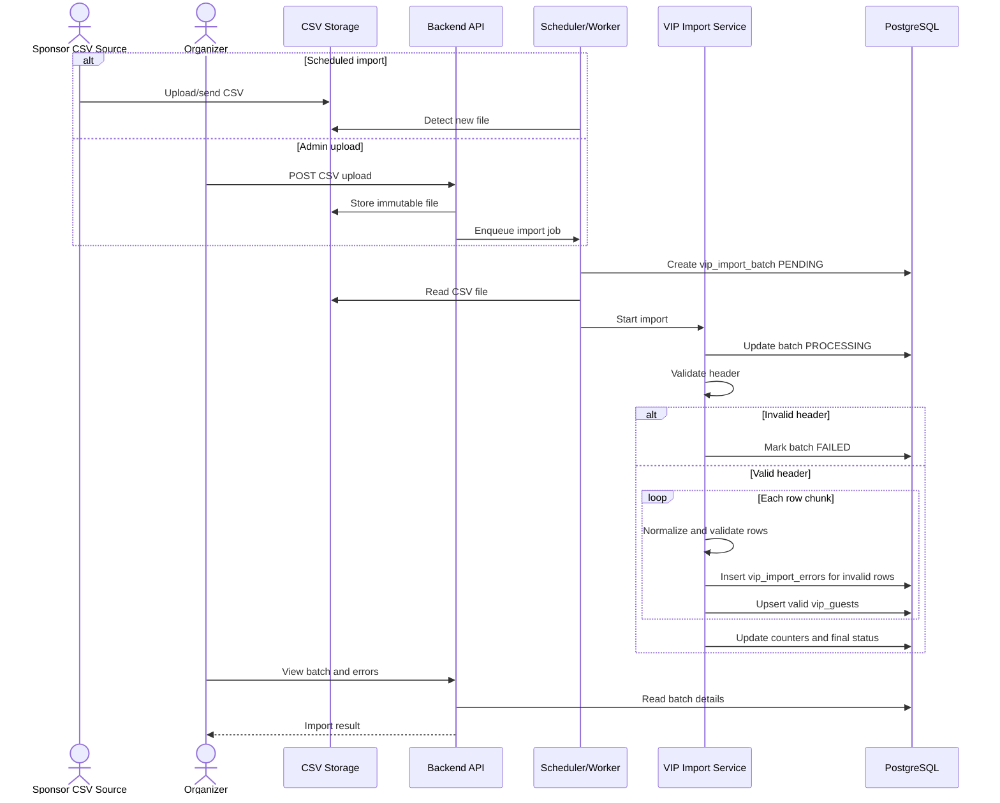

# Specification: VIP CSV Import

## Description

VIP CSV Import allows TicketBox to ingest sponsor-provided guest lists for concert VIP entrances. Files can be placed in a configured storage location for scheduled import or uploaded by organizers through an existing admin surface. The import flow validates file structure, normalizes guest identity fields, records row-level errors, deduplicates guests, and upserts valid records without interrupting check-in or existing platform services.

## Actors

- **Sponsor CSV Source**: Provides CSV files, often the night before the event.
- **Organizer**: Uploads CSV files, reviews import status, and resolves row errors.
- **Admin**: Has full visibility and override access.
- **VIP Gate Staff**: Searches VIP guests and performs VIP check-in at the entrance.
- **Scheduler/Worker**: Detects files and runs background imports.
- **VIP Import Service**: Parses, validates, deduplicates, and writes guest records.

## CSV Format

Expected header:

```csv
external_guest_id,full_name,email,phone,company,tier,event_id,invitation_code
```

Column rules:

| Column | Required | Notes |
| --- | --- | --- |
| `external_guest_id` | Conditional | Sponsor identity. Required when email and phone are missing. |
| `full_name` | Yes | Guest display name. Trim whitespace. |
| `email` | Conditional | Required when external id and phone are missing. Normalize lowercase. |
| `phone` | Conditional | Required when external id and email are missing. Normalize to project phone format. |
| `company` | No | Sponsor company or organization. |
| `tier` | Yes | One of `VIP`, `SVIP`, `SPONSOR`, `MEDIA`. |
| `event_id` | Yes | Must exist and match target event for admin uploads. |
| `invitation_code` | No | Store as hash if used for verification. |

## Main Flow: Scheduled Import

1. Sponsor sends a CSV file to the configured object storage bucket or import folder.
2. Scheduler detects a new file by path, timestamp, or unprocessed object marker.
3. Worker creates a `vip_import_batches` row with status `PENDING`.
4. Worker computes a SHA-256 file hash.
5. If `event_id + file_hash` already exists, the worker marks the new detection as duplicate or returns the existing batch.
6. Worker changes status to `PROCESSING`.
7. VIP Import Service parses the CSV header.
8. If the header is invalid, the batch is marked `FAILED` and no rows are imported.
9. Rows are streamed or read in bounded chunks.
10. Each row is normalized and validated.
11. Invalid rows are written to `vip_import_errors`.
12. Valid rows are deduplicated within the file.
13. Valid unique rows are upserted into `vip_guests`.
14. Batch counters are updated.
15. Batch status becomes `COMPLETED` or `COMPLETED_WITH_ERRORS`.

## Main Flow: Admin Upload Import

1. Organizer opens the existing admin surface for an event.
2. Organizer uploads a CSV file using `POST /api/admin/events/{eventId}/vip-imports`.
3. Backend verifies role `ORGANIZER` or `ADMIN` and event ownership.
4. Backend stores the uploaded file immutably.
5. Backend creates or schedules a `vip_import_batch`.
6. Worker processes the file using the same validation, deduplication, and upsert pipeline as scheduled import.
7. Organizer views batch status and row errors through the existing admin surface.

## Main Flow: VIP Guest Lookup and Check-in

1. VIP gate staff opens the mobile check-in app for the assigned event.
2. Staff searches by name, email, phone, company, or invitation code depending on configured policy.
3. When online, the app calls `GET /api/checkin/events/{eventId}/vip-guests/search`.
4. Backend enforces `GATE_STAFF` role and event assignment.
5. Backend returns matching active guests and current check-in status.
6. Staff selects the guest and confirms identity.
7. App calls `POST /api/checkin/events/{eventId}/vip-guests/{guestId}/checkin`.
8. Backend writes the VIP check-in transaction and prevents duplicate VIP check-in.
9. App displays accepted or duplicate rejection.
10. If network is unstable and the event policy allows offline VIP support, the app searches an expiring local VIP subset and stores pending VIP check-in records for later sync.

## Validation Rules

- Header must exactly contain required columns or map through a configured accepted alias set.
- `full_name` is required and must not be blank after trimming.
- At least one of `external_guest_id`, `email`, or `phone` must be present.
- `tier` must be one of `VIP`, `SVIP`, `SPONSOR`, `MEDIA`.
- `event_id` must exist.
- For admin upload, row `event_id` must match path `{eventId}`.
- Email must be syntactically valid after normalization.
- Phone must be normalizable; otherwise the row is invalid unless external id or email is present and policy allows phone omission.
- `invitation_code` must be unique per event when used as a credential.
- Rows with unparseable CSV structure must be recorded as row errors when row number can be identified.

## Deduplication Rules

Identity matching priority:

1. `event_id + external_guest_id`
2. `event_id + normalized_email`
3. `event_id + normalized_phone`

Within a file:

- If two rows have the same identity key and identical normalized content, keep one and count the other as skipped duplicate.
- If two rows have the same identity key but conflicting values, keep the last valid row or fail the later row according to event import policy. The default policy should keep the last valid row and record a duplicate warning.

Against existing records:

- Existing guests are updated by upsert using the identity priority.
- Mutable fields can be updated: `full_name`, `normalized_email`, `normalized_phone`, `company`, `tier`, `invitation_code_hash`, `source_batch_id`, `updated_at`.
- Check-in audit fields must not be cleared by import.
- A repeated file must not create duplicate guests.

## Error Scenarios

- **Missing file**: Upload API rejects the request or scheduled worker marks the batch `FAILED`.
- **Invalid CSV header**: Whole batch fails; no guest upserts are attempted.
- **Invalid row**: Row error is stored and valid rows continue.
- **Duplicate row**: Row is skipped, warned, or merged according to policy; no duplicate guest is created.
- **Invalid event id**: Row error for scheduled import; whole batch or row error for admin upload depending on whether all rows mismatch.
- **Import job crash**: Worker heartbeat and batch status allow retry. Idempotent upserts and file hash prevent duplicate guests.
- **Database temporarily unavailable**: Worker retries with exponential backoff and marks batch `FAILED` after retry limit.
- **Sponsor uploads the same file again**: `event_id + file_hash` detects duplicate import.
- **Partial import**: Batch ends as `COMPLETED_WITH_ERRORS` with exact counts and row-level errors.
- **VIP lookup during import**: Existing VIP lookup remains available. New or updated guests become visible after their upsert transaction commits.

## Observability and Logging

- Log import lifecycle events: file detected, batch created, processing started, header validation result, row validation counts, upsert counts, completion status.
- Log batch id, event id, source type, file hash, and worker id.
- Do not log raw personal data unnecessarily; mask email and phone in logs.
- Emit metrics for import duration, rows processed, invalid row count, duplicate count, failed batches, and worker retries.
- Emit alerts for repeated failed imports, high invalid-row rates, stuck `PROCESSING` batches, and storage polling failures.
- Store row-level details in `vip_import_errors` for organizer review.

## Acceptance Criteria

- Given a CSV with a valid header and all valid rows, when import runs, then all guests are inserted or updated and the batch is marked `COMPLETED`.
- Given a CSV file has 100 valid rows and 3 invalid rows, when import runs, then 100 guests are imported or upserted, 3 row errors are stored, and the batch is marked `COMPLETED_WITH_ERRORS`.
- Given the CSV header is invalid, when import runs, then no guest rows are imported and the batch is marked `FAILED`.
- Given a row has no `external_guest_id`, email, or phone, when import runs, then that row is rejected with a row error.
- Given a row has tier outside `VIP`, `SVIP`, `SPONSOR`, or `MEDIA`, when import runs, then that row is rejected.
- Given duplicate rows appear in the same file, when import runs, then only one guest record is created or updated.
- Given the same CSV file is imported twice for one event, when the second import runs, then no duplicate guests are created.
- Given the same guest appears in a later corrected CSV, when import runs, then the existing guest is updated by the deduplication key.
- Given VIP gate staff searches for a guest online, then only guests for assigned events are returned.
- Given a VIP guest is checked in twice, then the second check-in is rejected as duplicate.

## Sequence Diagram: CSV Import


