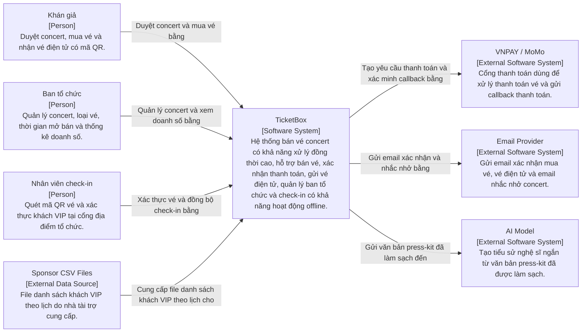
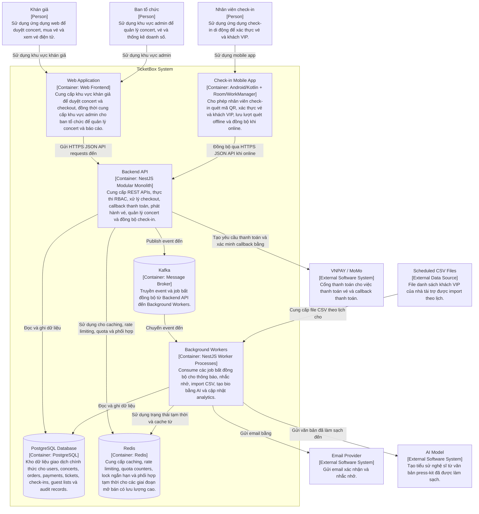
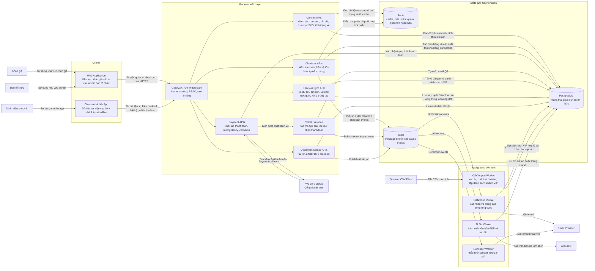
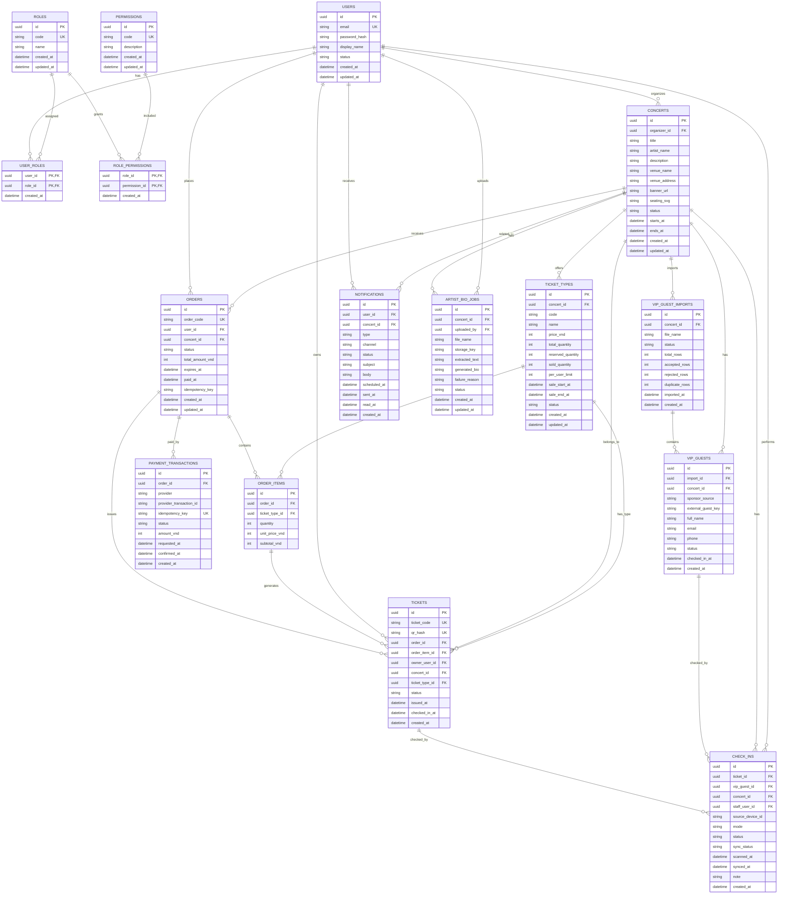

## Kiến trúc tổng thể

TicketBox sử dụng kết hợp **Kiến trúc Client-Server**, **Kiến trúc phân lớp** và **Kiến trúc hướng sự kiện**.

Ở cấp hệ thống, TicketBox tuân theo **Kiến trúc Client-Server**. Người dùng khán giả, người dùng ban tổ chức và nhân viên check-in sử dụng các ứng dụng client để gửi yêu cầu đến một backend server tập trung. Hệ thống cung cấp một ứng dụng web với hai khu vực theo vai trò: khu vực công khai dành cho khán giả để duyệt concert và mua vé, và khu vực quản trị dành cho ban tổ chức để quản lý concert và vé. Ứng dụng check-in di động được nhân viên sử dụng tại cổng địa điểm tổ chức. Các client này giao tiếp với backend thông qua HTTPS JSON APIs. Kiến trúc này phù hợp vì TicketBox cần kiểm soát tập trung đối với tồn kho vé, trạng thái thanh toán, quyền người dùng và xác thực check-in.

Bên trong backend, TicketBox tuân theo **Kiến trúc phân lớp**. Lớp Presentation/API cung cấp các REST endpoint và xử lý xác thực request, xác thực người dùng, phân quyền và giới hạn tần suất truy cập. Lớp Business Logic triển khai các quy tắc cốt lõi như kiểm tra tình trạng vé, giới hạn mua vé theo người dùng, tạo đơn hàng, xác nhận thanh toán, phát hành vé điện tử có mã QR, kích hoạt thông báo và đồng bộ check-in ngoại tuyến. Lớp Data Access đóng gói việc truy cập cơ sở dữ liệu, transaction, lock, repository, cache và publish message. Lớp Database lưu trữ dữ liệu chính thức trong PostgreSQL, trong khi Redis hỗ trợ caching, rate limiting, trạng thái phối hợp tạm thời và bảo vệ hệ thống trong các giai đoạn lưu lượng cao.

TicketBox cũng áp dụng **Kiến trúc hướng sự kiện** cho các workflow chậm hoặc dễ lỗi, không nên chặn luồng request chính. Sau các thay đổi trạng thái quan trọng như thanh toán thành công, phát hành vé, tải lên PDF hoặc nhận file CSV, backend publish event đến message broker. Background workers consume các event này để gửi thông báo, lên lịch nhắc nhở trước concert 24 giờ, xử lý import CSV khách VIP của nhà tài trợ, tạo tiểu sử nghệ sĩ bằng AI và cập nhật các projection thống kê. Cách tiếp cận này giảm coupling giữa quy trình mua vé cốt lõi và các workflow bất đồng bộ, đồng thời cho phép retry các tác vụ lỗi mà không chặn người dùng duyệt hoặc mua vé.

Các thành phần runtime chính gồm:

- Web Application: cung cấp hai khu vực theo vai trò: khu vực dành cho khán giả để duyệt concert, xem khu vực ghế, xem tình trạng vé, checkout và truy cập vé điện tử có mã QR; và khu vực quản trị dành cho ban tổ chức để quản lý concert, cấu hình vé, thiết lập thời gian mở bán và giới hạn mua vé theo người dùng, tải tài liệu nghệ sĩ, import danh sách khách VIP và xem báo cáo doanh số.
- Mobile Check-in App: cho phép nhân viên check-in quét mã QR vé và xác thực khách trong danh sách VIP, bao gồm cả khi mạng yếu hoặc không khả dụng.
- Backend API Server: cung cấp API cho client, thực thi RBAC, xử lý checkout, callback thanh toán, phát hành vé, quản lý concert và đồng bộ check-in.
- Background Workers: xử lý các job bất đồng bộ như thông báo, nhắc nhở, import CSV, tạo bio bằng AI và cập nhật analytics.
- PostgreSQL Database: đóng vai trò nguồn dữ liệu chính thức cho users, concerts, ticket types, orders, payments, tickets, check-ins, guest lists và audit records.
- Redis: hỗ trợ rate limiting, caching, lock ngắn hạn, quota counters và trạng thái tạm thời cần thiết cho các giai đoạn mở bán có lưu lượng cao.
- Message Broker: truyền event từ backend đến background workers để xử lý bất đồng bộ.
- External Systems: VNPAY/MoMo cho thanh toán, email provider cho xác nhận và nhắc nhở, AI model cho tạo tiểu sử nghệ sĩ và file CSV theo lịch từ nhà tài trợ cho danh sách khách VIP.

Mô hình giao tiếp chủ yếu là request-response cho các thao tác hướng người dùng và event-driven cho xử lý bất đồng bộ. Web và mobile client gọi Backend API qua HTTPS. Backend API đọc và ghi dữ liệu chính thức trong PostgreSQL, sử dụng Redis cho caching và bảo vệ lưu lượng, đồng thời publish event đến message broker. Workers consume event và tương tác với PostgreSQL, Redis, email, AI và nguồn CSV khi cần. Cổng thanh toán giao tiếp với TicketBox thông qua request tạo thanh toán và callback đã được xác minh. Ứng dụng check-in di động có thể hoạt động offline bằng cách lưu bản ghi quét cục bộ và đồng bộ với backend khi kết nối được khôi phục.

## C4 Diagram: Level 1 - System Context



## C4 Diagram: Level 2 - Container



## Sơ đồ kiến trúc mức cao



## Thiết kế cơ sở dữ liệu

TicketBox sử dụng **PostgreSQL** làm cơ sở dữ liệu giao dịch chính thức. Hệ thống có nhiều workflow nhạy cảm về tính nhất quán: giảm tồn kho vé, áp dụng giới hạn mua theo người dùng, xác nhận thanh toán, phát hành vé có mã QR và xác thực check-in. PostgreSQL phù hợp vì cung cấp ACID transactions, row-level locking, foreign keys, unique constraints và các chuyển đổi trạng thái đáng tin cậy cho các workflow này.

Redis không được xem là nguồn dữ liệu chính thức. Redis có thể lưu rate-limit counters tạm thời, lock ngắn hạn, quota counters và cached read models, nhưng PostgreSQL quyết định quyền sở hữu vé cuối cùng, trạng thái thanh toán, tính hợp lệ của vé, tính hợp lệ của khách VIP và trạng thái check-in.

### Quy ước cốt lõi

- Tất cả các bảng chính sử dụng UUID làm khóa chính.
- Các bản ghi chính có `created_at` và `updated_at`; `deleted_at` chỉ dùng khi cần soft deletion.
- Các cập nhật tồn kho có mức cạnh tranh cao chạy trong PostgreSQL transaction rõ ràng.
- Các dòng tồn kho vé được lock trước khi reservation, xác nhận bán hoặc release.
- Payment attempts sử dụng idempotency keys để ngăn tạo thanh toán trùng lặp.
- Provider transaction IDs được lưu để xử lý callback thanh toán theo cách idempotent.
- QR payload được backend ký; database lưu QR hash và trạng thái xác thực.
- Redis caches có thể được invalidate hoặc rebuild từ PostgreSQL.



### Các nhóm bảng chính

- **Identity and RBAC**: `users`, `roles`, `permissions`, `user_roles` và `role_permissions` hỗ trợ ba nhóm người dùng: Audience, Organizer và Check-in Staff.
- **Cấu hình concert và vé**: `concerts` lưu metadata concert, thông tin nghệ sĩ và địa điểm, thời gian bán, trạng thái và sơ đồ ghế SVG. `ticket_types` lưu các hạng vé theo khu vực như GA, SVIP, VIP, CAT1 và CAT2, bao gồm giá, sức chứa, thời gian mở bán và giới hạn mua theo người dùng.
- **Mua vé và tồn kho**: `orders` và `order_items` thể hiện ý định mua. `ticket_types.reserved_quantity` được dùng cho reservation trong giai đoạn checkout/payment đang chờ, trong khi `sold_quantity` thể hiện vé đã thanh toán thành công. Tình trạng vé còn lại cuối cùng được tính từ `total_quantity - reserved_quantity - sold_quantity`.
- **Thanh toán**: `payment_transactions` ghi nhận các lần thử thanh toán VNPAY/MoMo, idempotency keys, provider transaction IDs, số tiền và trạng thái thanh toán cuối cùng. Payment callbacks chỉ cập nhật trạng thái đơn hàng thông qua các chuyển đổi trạng thái có tính idempotent.
- **Vé**: `tickets` chỉ được phát hành sau khi xác nhận thanh toán thành công. Mỗi vé có `qr_hash` duy nhất, chủ sở hữu, loại vé, trạng thái và trạng thái check-in.
- **Check-in**: `check_ins` ghi nhận các lượt quét tại cổng địa điểm. Một bản ghi check-in có thể tham chiếu vé thường hoặc mục trong danh sách khách VIP. Các lượt quét phát sinh offline bao gồm device ID, thời điểm quét, trạng thái đồng bộ và kết quả xử lý xung đột.
- **Import danh sách khách VIP**: `vip_guest_imports` ghi nhận từng lần import CSV theo lịch. `vip_guests` lưu các khách mời hợp lệ của nhà tài trợ sau khi xác thực và loại bỏ trùng lặp.
- **AI artist bio**: `artist_documents` lưu PDF hoặc press kit được tải lên và trạng thái trích xuất. `ai_artist_bios` lưu kết quả bio được tạo, trạng thái tạo và lý do lỗi khi trích xuất hoặc tạo nội dung bằng AI thất bại.
- **Thông báo**: `notifications` lưu thông báo trong ứng dụng và các job email theo lịch cho xác nhận mua vé và nhắc nhở trước 24 giờ.
- **Audit logs**: `audit_logs` ghi nhận các thao tác nhạy cảm như hủy concert, thay đổi loại vé, import CSV, thay đổi trạng thái thanh toán và xử lý xung đột check-in.

### Ràng buộc và index quan trọng

- `users.email` phải là duy nhất.
- `ticket_types` có unique `(concert_id, code)`.
- `ticket_types.sold_quantity + ticket_types.reserved_quantity` không được vượt quá `total_quantity`.
- `orders` nên được index theo `(user_id, concert_id, status)` và `(concert_id, status)`.
- `order_items` nên được index theo `(ticket_type_id)`.
- Giới hạn mua vé theo người dùng được thực thi bằng cách kiểm tra paid orders và issued tickets theo `(user_id, concert_id, ticket_type_id)`.
- `payment_transactions.idempotency_key` phải là duy nhất.
- `payment_transactions` nên có unique nullable `(provider, provider_transaction_id)` để xử lý callback lặp lại từ provider.
- `tickets.qr_hash` phải là duy nhất.
- `tickets` nên được index theo `(concert_id, ticket_type_id, status)`.
- `check_ins` chỉ cho phép tối đa một lượt check-in thành công cho mỗi `ticket_id`.
- `check_ins` chỉ cho phép tối đa một lượt check-in thành công cho mỗi `vip_guest_id`.
- `check_ins` nên được index theo `(source_device_id, sync_status)` để phục vụ đồng bộ mobile.
- `vip_guests` nên unique theo `(concert_id, sponsor_source, external_guest_key)` khi có external key.
- Khi không có external guest key, phát hiện trùng lặp nên dùng tên, email và số điện thoại đã được chuẩn hóa.
- `notifications` nên được index theo `(user_id, status)` và `(scheduled_at, status)`.
- `audit_logs` nên được index theo `(actor_user_id, created_at)` và `(target_type, target_id)`.

## Thiết kế kiểm soát truy cập (RBAC)

TicketBox sử dụng kiểm soát truy cập theo vai trò kết hợp với kiểm tra quyền sở hữu và phân công. RBAC được thực thi tại API boundary bằng NestJS guards và được kiểm tra lại trong domain services đối với các thao tác nhạy cảm theo quyền sở hữu. Token định danh người dùng đã xác thực và có thể chứa gợi ý vai trò cho UI hoặc routing, nhưng quyết định phân quyền cuối cùng sử dụng bản ghi vai trò và quyền ở phía server.

Danh sách concert đã publish và trang chi tiết concert được phép đọc công khai. Các thao tác mua vé, truy cập vé, quản trị của ban tổ chức, thao tác liên quan đến thanh toán và đồng bộ check-in đều yêu cầu xác thực.

| Capability                                                | Audience         | Organizer                                      | Check-in Staff                            |
| --------------------------------------------------------- | ---------------- | ---------------------------------------------- | ----------------------------------------- |
| Duyệt concert đã publish và tình trạng vé                 | Được phép        | Được phép                                      | Tùy chọn chỉ đọc                          |
| Xem chi tiết concert và sơ đồ ghế                         | Được phép        | Được phép                                      | Tùy chọn chỉ đọc                          |
| Mua vé                                                    | Được phép        | Chỉ được phép nếu cũng hành động như Audience  | Từ chối                                   |
| Xem vé của chính mình                                     | Được phép nếu là chủ sở hữu | Được phép nếu là chủ sở hữu          | Từ chối                                   |
| Tạo/cập nhật/hủy concert                                  | Từ chối          | Được phép với concert thuộc sở hữu             | Từ chối                                   |
| Cấu hình loại vé, thời gian mở bán và giới hạn mua theo người dùng | Từ chối | Được phép với concert thuộc sở hữu | Từ chối                                   |
| Xem thống kê doanh số/doanh thu                           | Từ chối          | Được phép với concert thuộc sở hữu             | Từ chối                                   |
| Tải lên artist PDF hoặc press kit                         | Từ chối          | Được phép với concert thuộc sở hữu             | Từ chối                                   |
| Xem trạng thái xử lý AI bio                               | Từ chối          | Được phép với concert thuộc sở hữu             | Từ chối                                   |
| Xem kết quả import VIP CSV                                | Từ chối          | Được phép với concert thuộc sở hữu             | Từ chối                                   |
| Quét mã QR vé và xác thực khách trong danh sách VIP       | Từ chối          | Mặc định từ chối                               | Được phép với concert/cổng được phân công |
| Đồng bộ check-in offline                                  | Từ chối          | Mặc định từ chối                               | Được phép với concert/cổng được phân công |

Quy tắc kiểm soát truy cập:

- Các endpoint duyệt concert công khai chỉ expose dữ liệu concert đã publish và không expose các trường chỉ dành cho organizer.
- Audience ticket APIs được scope theo `ticket.owner_user_id`; người dùng chỉ có thể xem vé của chính mình.
- Organizer APIs được scope theo `concert.organizer_id`; một organizer không thể quản lý concert thuộc sở hữu của organizer khác.
- Check-in staff APIs được scope theo assigned concert IDs hoặc gate assignments; staff không thể truy cập purchase, payment, organizer management hoặc revenue APIs.
- Web admin routes yêu cầu organizer permissions; mobile scan và sync routes yêu cầu check-in permissions.
- API guards thực hiện xác thực, kiểm tra vai trò và quyền trước khi đi vào business logic.
- Domain services lặp lại kiểm tra ownership hoặc assignment trước các thay đổi trạng thái nhạy cảm như hủy concert, thay đổi số lượng loại vé, review import CSV, thay đổi trạng thái thanh toán và xử lý xung đột check-in.
- Các thao tác nhạy cảm được ghi vào audit logs với actor, action, target, timestamp và metadata liên quan.

## Thiết kế cơ chế bảo vệ

### Kiểm soát lưu lượng tăng đột biến

TicketBox giới hạn lưu lượng quá mức trước khi request đi vào business logic tốn tài nguyên như lock tồn kho, tạo đơn hàng hoặc khởi tạo thanh toán.

- Rate limiting dựa trên Redis chạy ở lớp NestJS gateway/middleware.
- Thuật toán chính là token bucket cho checkout và payment initiation APIs, vì thuật toán này cho phép burst ngắn nhưng vẫn giới hạn hành vi lạm dụng kéo dài.
- Fixed-window limits có thể được dùng cho các API duyệt công khai đơn giản hơn.
- Các chiều rate-limit gồm IP address, authenticated user ID, device ID, endpoint group và concert ID trong sale windows.
- Checkout và payment-initiation endpoints sử dụng giới hạn nghiêm ngặt hơn browsing endpoints.
- Request vượt giới hạn nhận HTTP `429 Too Many Requests` kèm retry metadata.
- Các request lặp lại có hành vi giống bot có thể nhận cooldown ngắn dựa trên Redis.
- Các trang concert có lưu lượng đọc lớn sử dụng Redis cache-aside reads để traffic spikes không trực tiếp trở thành read spikes trên PostgreSQL.
- Kafka được dùng cho các công việc fan-out không quan trọng tức thời như notifications, reminders, CSV imports, AI jobs và analytics updates.

Ví dụ giới hạn có thể cấu hình:

| Endpoint group          | Example limit                           | Behavior when exceeded                 |
| ----------------------- | --------------------------------------: | -------------------------------------- |
| Public concert browsing | 60 requests/minute per IP               | Return 429 with retry time             |
| Authenticated user APIs | 120 requests/minute per user            | Return 429 with retry time             |
| Checkout attempts       | 5 requests/minute per user per concert  | Return 429 and short cooldown          |
| Payment initiation      | 3 requests/minute per user per order    | Return existing payment attempt or 429 |
| Mobile check-in sync    | 30 requests/minute per device           | Return 429 and retry later             |

Payment callbacks không được bảo vệ bằng rate limit người dùng thông thường. Chúng phải vượt qua provider signature verification và có thể được giới hạn bằng network rules riêng cho provider trong môi trường triển khai.

### Bảo vệ tồn kho vé và quota theo người dùng

TicketBox bảo vệ tồn kho vé giới hạn và giới hạn mua theo người dùng do organizer cấu hình bằng cả phối hợp nhanh qua Redis và transaction chính thức trong PostgreSQL.

Luồng mua vé:

1. Gateway rate limit cho phép request đi tiếp.
2. Redis thực hiện fast quota pre-check cho user, concert, ticket type và số lượng yêu cầu.
3. Redis lock ngắn hạn phối hợp truy cập cạnh tranh cao vào cùng một loại vé.
4. PostgreSQL transaction lock dòng `ticket_types` mục tiêu trước khi cập nhật số lượng reserved hoặc sold.
5. Service kiểm tra sức chứa còn lại và số lượng người dùng đã paid hoặc đã được issued từ PostgreSQL.
6. Nếu request hợp lệ, hệ thống tạo order và order items, sau đó reserve inventory trong giai đoạn chờ thanh toán.
7. Nếu thanh toán thành công, reserved inventory chuyển thành sold inventory và vé có mã QR được phát hành.
8. Nếu order hết hạn hoặc thanh toán thất bại, reserved inventory được release.
9. Redis availability cache và quota counters được điều chỉnh hoặc invalidate sau các event thay đổi tồn kho.

PostgreSQL vẫn là nguồn quyết định cuối cùng cho tồn kho và giới hạn mua theo người dùng. Redis counters và locks chỉ bảo vệ hot paths và giảm database contention không cần thiết.

### Xử lý lỗi cổng thanh toán

VNPAY và MoMo được tích hợp thông qua provider adapters để lỗi cổng thanh toán được cô lập khỏi browsing, concert detail, check-in và các tính năng không liên quan đến thanh toán.

Mỗi payment provider có circuit breaker với ba trạng thái:

| State     | Meaning                          | Behavior                                            |
| --------- | -------------------------------- | --------------------------------------------------- |
| Closed    | Provider được xem là khỏe mạnh   | Payment requests được gửi bình thường              |
| Open      | Provider được xem là không khỏe  | Chặn payment initiation mới cho provider đó        |
| Half-Open | Hệ thống đang kiểm tra phục hồi  | Cho phép một số lượng request thử nghiệm giới hạn  |

Ví dụ ngưỡng kích hoạt:

- Mở circuit sau 5 lần timeout/network failure liên tiếp.
- Mở circuit nếu hơn 50% trong 20 payment initiation attempts gần nhất thất bại.
- Giữ circuit ở trạng thái open trong 60 giây trước khi chuyển sang Half-Open.
- Ở Half-Open, cho phép một test request. Nếu thành công thì đóng circuit; nếu không thì mở lại.

Hành vi khi lỗi:

- Nếu một provider không khả dụng, checkout có thể đề xuất provider còn lại.
- Nếu cả hai provider không khả dụng, payment initiation trả về controlled unavailable response.
- Người dùng vẫn có thể duyệt concert, xem chi tiết concert và xem tình trạng vé.
- Payment callbacks vẫn được chấp nhận và xác minh ngay cả khi payment initiation mới bị vô hiệu hóa.
- Unpaid orders hết hạn sẽ release reserved inventory thông qua scheduled worker.

### Ngăn thanh toán trùng

Mỗi lần payment initiation sử dụng một idempotency key cho một user, order, provider và amount cụ thể.

Lưu trữ:

- PostgreSQL lưu bản ghi idempotency chính thức trong `payment_transactions.idempotency_key`.
- PostgreSQL cũng lưu provider transaction IDs với unique nullable `(provider, provider_transaction_id)` constraint.
- Redis có thể cache idempotency responses trong TTL ngắn, ví dụ 15 phút, để trả nhanh kết quả cho payment initiation lặp lại.

Luồng xử lý trùng:

1. Client hoặc server cung cấp idempotency key khi khởi tạo thanh toán.
2. Nếu idempotency key mới, TicketBox tạo một bản ghi `payment_transactions`.
3. Nếu cùng key được dùng lại với cùng order, provider và amount, TicketBox trả về trạng thái payment transaction hiện có.
4. Nếu cùng key được dùng lại với order, provider hoặc amount khác, TicketBox từ chối request với HTTP `409 Conflict`.
5. Nếu provider callback bị gửi lặp lại, TicketBox phát hiện `(provider, provider_transaction_id)` hiện có hoặc trạng thái order đã là final.
6. Callback lặp lại không tạo thêm paid order và không phát hành vé trùng.

Chuyển đổi trạng thái đơn hàng là một chiều:

```text
pending_payment -> paid -> tickets_issued
pending_payment -> expired
pending_payment -> cancelled
```

Vé có mã QR chỉ được phát hành sau khi xác nhận thanh toán đã được xác minh. Redirect thanh toán ở phía client không bao giờ được dùng làm bằng chứng thanh toán.

### Caching

TicketBox sử dụng Redis với chiến lược cache-aside cho dữ liệu có lưu lượng đọc cao. PostgreSQL vẫn là nguồn dữ liệu chính thức, và checkout luôn xác thực tồn kho cũng như quota với PostgreSQL trước khi thay đổi trạng thái cuối cùng.

| Cached object              | Strategy                        | Example TTL    | Invalidation                                                            |
| -------------------------- | ------------------------------- | -------------: | ----------------------------------------------------------------------- |
| Concert list               | Cache-aside                     | 60 seconds     | Concert create/update/cancel                                            |
| Concert detail             | Cache-aside                     | 5 minutes      | Concert update/cancel hoặc published version change                     |
| SVG seating map            | Cache-aside + version key       | 30 minutes     | Seating map hoặc ticket type change                                     |
| Ticket availability        | Cache-aside / active adjustment | 3-5 seconds    | Payment success, reservation expiry, ticket release, ticket type change |
| Organizer sales statistics | Cache-aside projection          | 30-60 seconds  | Payment success, ticket issuance, cancellation                          |

Quy tắc caching:

- Các trang công khai có thể hiển thị số lượng vé còn lại mang tính xấp xỉ.
- Checkout không bao giờ tin cached availability cho quyết định mua cuối cùng.
- Thanh toán thành công, reservation expiration và ticket release sẽ cập nhật hoặc invalidate availability keys.
- Cache metadata concert dùng TTL dài hơn vì dữ liệu thay đổi ít hơn.
- Cache ticket availability dùng TTL ngắn vì dữ liệu thay đổi trong sale windows.
- Cache misses rebuild dữ liệu từ PostgreSQL và repopulate Redis.

### Bảo vệ check-in ngoại tuyến

Ứng dụng check-in di động phải tiếp tục hoạt động khi mạng yếu hoặc không khả dụng mà không làm mất bản ghi quét.

- Trước hoặc trong sự kiện, mobile app tải dữ liệu vé được phân công và danh sách khách VIP cho concert hoặc gate mà app được phép check.
- App lưu dữ liệu này và local scan logs trong local storage.
- Khi offline, lượt quét được xác thực với dữ liệu cục bộ và được ghi vào durable local scan log.
- App phát hiện lượt quét trùng trên cùng thiết bị ngay lập tức.
- Khi kết nối trở lại, app upload pending scan logs đến check-in sync API.
- Backend lưu check-ins được chấp nhận trong PostgreSQL.
- PostgreSQL thực thi tối đa một check-in thành công cho mỗi vé hoặc mỗi khách VIP.
- Nếu hai thiết bị quét cùng một vé khi offline, lượt quét hợp lệ được đồng bộ trước sẽ thắng; các lượt quét sau được đánh dấu là duplicate hoặc conflict.

## Architecture Decision Records (ADR)

### ADR 1 — Sử dụng kiến trúc kết hợp Client-Server, Layered và Event-driven

**Decision:** TicketBox sử dụng Client-Server Architecture ở cấp hệ thống, Layered Architecture bên trong backend và Event-driven Architecture cho các workflow bất đồng bộ.

**Rationale:** TicketBox cần kiểm soát tập trung đối với tồn kho vé, trạng thái thanh toán, quyền người dùng và xác thực check-in, vì vậy Client-Server là phù hợp. Backend chứa nhiều miền nghiệp vụ, nên Layered Architecture giúp tách biệt trách nhiệm, tăng khả năng bảo trì và kiểm thử. Notifications, reminders, CSV imports, AI bio generation và analytics không nên chặn luồng mua vé chính, vì vậy Event-driven Architecture được dùng cho các workflow này.

**Trade-offs:** Kiểu kiến trúc hybrid này phức tạp hơn một ứng dụng web phân lớp đơn giản vì cần message broker và background workers. Tuy nhiên, nó cải thiện khả năng mở rộng và cô lập lỗi cho các tác vụ chậm hoặc dễ lỗi.

---

### ADR 2 — Sử dụng modular monolith thay vì microservices cho backend

**Decision:** Backend được triển khai dưới dạng NestJS modular monolith.

**Rationale:** Các workflow cốt lõi như checkout, cập nhật tồn kho, áp dụng quota theo người dùng, xác nhận thanh toán, phát hành vé và xác thực check-in cần phối hợp thay đổi trạng thái trên cùng dữ liệu giao dịch. Giữ các domain cốt lõi trong một backend giúp giảm độ phức tạp của distributed transactions nhưng vẫn cho phép ranh giới module rõ ràng.

**Trade-offs:** Modular monolith có thể trở nên tightly coupled nếu ranh giới module không được thực thi tốt. Trong tương lai có thể cần tách thành các service riêng nếu quy mô team ownership hoặc deployment tăng lên.

---

### ADR 3 — Sử dụng PostgreSQL làm cơ sở dữ liệu chính thức

**Decision:** PostgreSQL được sử dụng làm system of record cho users, concerts, ticket types, orders, payments, tickets, check-ins, guest lists, AI processing status, notifications và audit logs.

**Rationale:** TicketBox cần tính nhất quán mạnh cho tồn kho vé, giới hạn mua theo người dùng, trạng thái thanh toán, phát hành vé và xác thực check-in. PostgreSQL cung cấp ACID transactions, foreign keys, unique constraints, indexes và row-level locking.

**Trade-offs:** PostgreSQL có thể trở thành bottleneck khi lưu lượng đọc cao nếu mọi request trang công khai đều truy vấn trực tiếp vào nó. TicketBox giảm thiểu rủi ro này bằng Redis caching và transaction boundaries được thiết kế cẩn thận.

---

### ADR 4 — Sử dụng Redis cho caching, rate limiting, quota và phối hợp ngắn hạn

**Decision:** Redis được dùng cho public read caches, rate limiting, short-lived locks, quota pre-check counters và temporary coordination state.

**Rationale:** TicketBox có các trang concert đọc nhiều và sale windows có mức cạnh tranh cao. Redis cung cấp truy cập độ trễ thấp cho dữ liệu không cần làm nguồn dữ liệu chính thức, giúp giảm tải PostgreSQL và bảo vệ hot paths trước khi business logic tốn tài nguyên chạy.

**Trade-offs:** Dữ liệu Redis có thể stale hoặc bị mất, vì vậy Redis không được là nguồn quyết định cuối cùng cho quyền sở hữu vé, trạng thái thanh toán hoặc tính hợp lệ của check-in. PostgreSQL vẫn là source of truth.

---

### ADR 5 — Sử dụng Kafka làm message broker cho workflow bất đồng bộ

**Decision:** Kafka được sử dụng làm message broker giữa Backend API và background workers.

**Rationale:** TicketBox có nhiều workflow chậm hoặc dễ lỗi: email notifications, nhắc nhở trước 24 giờ, sponsor CSV imports, AI artist-bio generation và analytics projection updates. Kafka tách các workflow này khỏi request checkout và browsing đồng bộ, hỗ trợ xử lý có thể retry và cho phép thêm consumer mới sau này.

**Trade-offs:** Kafka làm tăng độ phức tạp vận hành so với gọi đồng bộ trực tiếp hoặc in-process queue. Với thiết kế này, lợi ích là kiến trúc hướng sự kiện rõ ràng hơn và cô lập tốt hơn các công việc bất đồng bộ.

---

### ADR 6 — Sử dụng pessimistic locking cho tồn kho vé có cạnh tranh cao

**Decision:** Cập nhật tồn kho vé sử dụng PostgreSQL transactions và row-level locks trên dòng tồn kho của ticket type trong quá trình reservation, xác nhận bán và release.

**Rationale:** Các hạng vé phổ biến như SVIP có thể có sức chứa rất giới hạn và nhu cầu đồng thời rất cao. Pessimistic locking ngăn hai transaction đồng thời gán cùng một phần capacity cuối cùng.

**Trade-offs:** Pessimistic locking có thể giảm throughput và tăng thời gian chờ khi cạnh tranh cao. Redis rate limiting và phối hợp ngắn hạn giúp giảm database contention không cần thiết trước khi request đi vào critical transaction.

---

### ADR 7 — Sử dụng xác thực token kết hợp kiểm tra phân quyền phía server

**Decision:** Client xác thực bằng token, trong khi quyết định phân quyền cuối cùng dùng role, permission, ownership và assignment checks ở phía server.

**Rationale:** TicketBox có ba nhóm người dùng: Audience, Organizer và Check-in Staff. Một số quyền không chỉ phụ thuộc vào vai trò mà còn phụ thuộc vào ownership hoặc assignment, ví dụ organizer chỉ quản lý concert của chính họ hoặc check-in staff chỉ đồng bộ các cổng sự kiện được phân công.

**Trade-offs:** Kiểm tra quyền phía server làm tăng truy vấn database hoặc cache, nhưng ngăn claims lỗi thời từ client cấp quyền truy cập trái phép.

---

### ADR 8 — Sử dụng local mobile storage cho check-in offline

**Decision:** Ứng dụng check-in di động lưu dữ liệu vé và danh sách khách VIP được phân công, cùng với offline scan logs, trong local device storage như SQLite hoặc WatermelonDB.

**Rationale:** Kết nối mạng tại địa điểm tổ chức có thể yếu hoặc không khả dụng. Local storage cho phép nhân viên tiếp tục xác thực vé và khách VIP, sau đó đồng bộ scan logs khi kết nối trở lại.

**Trade-offs:** Offline validation có thể tạo xung đột nếu hai thiết bị quét cùng một vé trước khi đồng bộ. Backend xử lý xung đột bằng quy tắc first-valid-sync-wins và unique successful check-in constraints.

---

### ADR 9 — Sử dụng provider adapters và idempotency cho tích hợp thanh toán

**Decision:** VNPAY và MoMo được tích hợp thông qua provider adapters, và mọi payment attempt sử dụng idempotency keys cùng provider transaction reconciliation.

**Rationale:** Cổng thanh toán có thể timeout, lỗi hoặc gửi callback lặp lại. Provider adapters cô lập logic riêng của từng cổng thanh toán, trong khi idempotency ngăn payment transactions trùng và phát hành vé trùng.

**Trade-offs:** Quản lý trạng thái thanh toán trở nên phức tạp hơn vì orders, payment transactions và tickets phải đi theo các chuyển đổi trạng thái rõ ràng. Sự phức tạp này cần thiết để tránh double charges và missing tickets.

---

### ADR 10 — Sử dụng cache-aside cho dữ liệu concert công khai

**Decision:** TicketBox sử dụng cache-aside caching cho concert lists, concert details, SVG seating maps, ticket availability và organizer statistics projections.

**Rationale:** Các trang concert công khai được đọc thường xuyên, đặc biệt trong sale windows. Cache-aside giúp giảm tải trực tiếp lên PostgreSQL trong khi vẫn cho phép PostgreSQL là nguồn dữ liệu chính thức.

**Trade-offs:** Dữ liệu cache có thể tạm thời stale, đặc biệt là ticket availability. Checkout không bao giờ tin cached availability cho quyết định mua cuối cùng và luôn xác thực với PostgreSQL.
