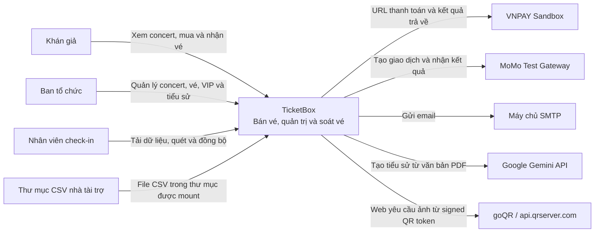
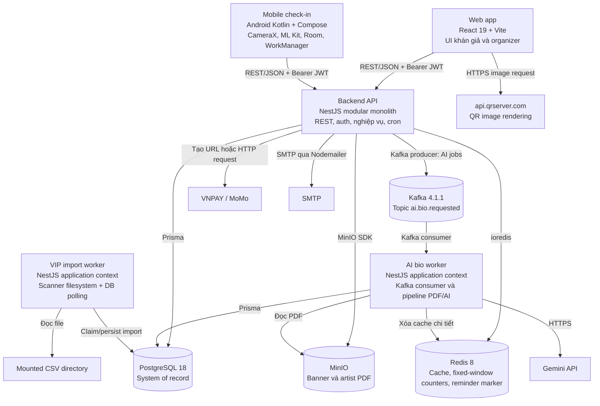
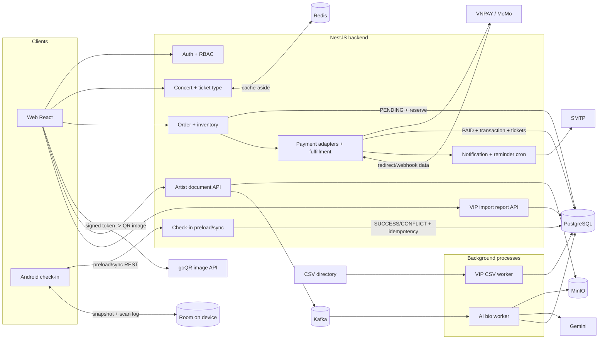
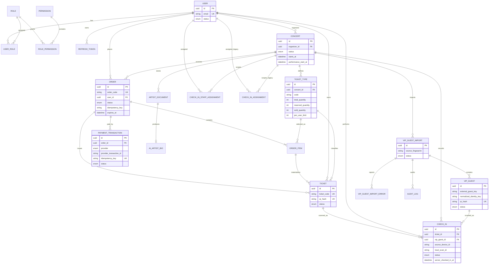

# TicketBox — Technical Design

## Kiến trúc tổng thể

TicketBox là hệ thống client–server với backend **modular monolith** NestJS. Các module nghiệp vụ cùng chạy trong một tiến trình API và dùng chung Prisma/PostgreSQL; chúng không phải microservice. Hai công việc nền được tách thành tiến trình độc lập vì có vòng đời và đặc tính tải khác request HTTP:

- `ai-bio-worker` nhận job từ Kafka, đọc PDF trong MinIO, trích xuất văn bản và gọi mô hình AI.
- `vip-import-worker` tự quét thư mục CSV mỗi 60 giây và polling tối đa 10 import có trạng thái chờ mỗi 10 giây. “Queue” của luồng này là trạng thái trong PostgreSQL, không phải Kafka.

Web app React phục vụ cả khán giả và ban tổ chức. Ứng dụng Android Kotlin/Jetpack Compose là client riêng cho nhân viên check-in; app giao tiếp REST với backend và dùng Room để hoạt động ngoại tuyến. Các client không truy cập trực tiếp PostgreSQL, Redis, Kafka hay MinIO.

Backend giao tiếp đồng bộ với PostgreSQL qua Prisma, với Redis qua `ioredis`, với MinIO qua MinIO SDK, với SMTP qua Nodemailer và với MoMo qua HTTP. Tích hợp VNPAY tạo URL có chữ ký để trình duyệt chuyển hướng. Riêng pipeline AI dùng Kafka topic `ai.bio.requested`; worker gọi Gemini `gemini-2.5-flash` theo cấu hình Docker. Web gửi signed QR token tới `api.qrserver.com` để nhận ảnh QR hiển thị trên e-ticket. REST/JSON là giao thức giữa client và backend; repository không triển khai GraphQL hoặc WebSocket.

Pipeline AI giới hạn PDF ở 10 MB, yêu cầu ít nhất 50 ký tự sau trích xuất và chỉ đưa tối đa 4.000 ký tự vào model. MinIO có timeout 10 giây; worker retry download tối đa 3 lần với backoff 500/1.000 ms. Lời gọi AI có timeout 30 giây và tối đa 2 lần thử; lần retry timeout chờ 500 ms, còn retry do HTTP 429 chờ 60 giây. Trạng thái lỗi được ghi vào `artist_documents`/`ai_artist_bios` thay vì làm thất bại request mua vé.

Phạm vi lỗi được cô lập theo thành phần:

- PostgreSQL hỏng làm các nghiệp vụ có trạng thái không hoạt động.
- Redis hỏng làm cache chuyển thành cache miss và rate limiting chuyển sang fail-open; request vẫn đi tiếp nhưng PostgreSQL chịu tải lớn hơn.
- Kafka hoặc AI worker hỏng chỉ làm pipeline tiểu sử bị chờ/lỗi; duyệt concert, mua vé và check-in không phụ thuộc pipeline này.
- VIP worker hỏng không ảnh hưởng API chính; import giữ nguyên trạng thái trong PostgreSQL để lần polling sau xử lý lại.
- MinIO hỏng ảnh hưởng upload/download banner và press kit. Lỗi cổng thanh toán không ảnh hưởng các route concert hoặc check-in.

Kiến trúc này phù hợp phạm vi đồ án vì transaction của order, tồn kho, payment, ticket và check-in vẫn ở một cơ sở dữ liệu, trong khi hai tác vụ dài được tách khỏi đường request chính. Đánh đổi là API backend và PostgreSQL vẫn là điểm tập trung, còn một số cơ chế như circuit breaker có trạng thái cục bộ theo tiến trình.

Docker Compose khởi chạy `frontend`, `backend`, `ai-bio-worker`, `vip-import-worker`, PostgreSQL 18, Redis 8, Kafka 4.1.1 và MinIO. `minio-init` là job khởi tạo bucket một lần, không phải service nghiệp vụ chạy thường trực. Scheduler hết hạn order và nhắc concert chạy ngay trong `backend` bằng `@nestjs/schedule`.

## C4 Diagram

### Level 1 — System Context



VNPAY, MoMo, SMTP, Gemini và goQR là các tích hợp ngoài có đường gọi trong code/configuration. Trình duyệt gọi goQR trực tiếp bằng signed QR token. Push, SMS và Zalo không xuất hiện như hệ thống ngoài vì các provider tương ứng hiện chỉ tạo response trong memory, không gọi dịch vụ mạng.

### Level 2 — Container



## High-Level Architecture Diagram



## Thiết kế cơ sở dữ liệu

PostgreSQL 18 là cơ sở dữ liệu chính. Prisma schema và các migration trong `backend/prisma/migrations` định nghĩa mô hình mà backend thực sự dùng. PostgreSQL phù hợp với các quan hệ ownership, order–item–ticket và các ràng buộc duy nhất cần cho idempotency/check-in. Redis không phải nguồn dữ liệu chính thức.

Các nhóm entity chính:

- **Identity và RBAC:** `users`, `roles`, `permissions`, `user_roles`, `role_permissions`, `refresh_tokens`.
- **Concert và bán vé:** `concerts`, `ticket_types`, `orders`, `order_items`, `payment_transactions`, `tickets`.
- **Soát vé:** `check_ins`, `check_in_staff_assignments` và `check_in_assignments`. Controller hiện dùng `check_in_staff_assignments` để liệt kê assignment; service preload còn đọc cả hai cấu trúc để tương thích dữ liệu gate/device.
- **Nội dung AI:** `artist_documents`, `ai_artist_bios`. `artist_bio_jobs` vẫn có trong schema cũ nhưng pipeline đang chạy không ghi bảng này.
- **Khách VIP:** `vip_guest_imports`, `vip_guests`, `vip_guest_import_errors`, `audit_logs`.
- **Notification:** `notifications` có trong schema, nhưng `NotificationsService` hiện gửi trực tiếp qua provider và không đọc/ghi bảng này; vì vậy bảng không phải hộp thư in-app đang hoạt động.



Các constraint và index có ý nghĩa nghiệp vụ lớn:

- `ticket_types(concert_id, code)` là duy nhất; các index theo concert/status phục vụ đọc danh mục.
- `orders(user_id, idempotency_key)` và `orders(order_code)` là duy nhất.
- `payment_transactions.idempotency_key` và cặp `(provider, provider_transaction_id)` là duy nhất.
- `tickets.ticket_code` và `tickets.qr_hash` là duy nhất.
- Partial unique index chỉ cho phép một `check_ins` trạng thái `SUCCESS` trên mỗi `ticket_id` và mỗi `vip_guest_id`.
- Partial unique index `(source_device_id, local_scan_id)` bảo đảm một scan offline của một thiết bị chỉ được ghi một lần.
- Một file import được nhận diện duy nhất bởi `(concert_id, source_name, source_fingerprint)`; khách có `external_guest_key` duy nhất theo concert/nguồn, còn khách không có khóa ngoài được đối chiếu bằng normalized identity key.
- `ai_artist_bios.document_id` là duy nhất, nên mỗi `artist_document` có tối đa một kết quả bio.

Transaction và concurrency:

- Tạo order chạy trong một Prisma interactive transaction. Mỗi loại vé được giữ bằng atomic conditional update: tăng `reserved_quantity` chỉ khi `total_quantity - reserved_quantity - sold_quantity` còn đủ. Đây là cơ chế chống overselling thực tế; code không dùng pessimistic row lock hay Redis lock.
- Thanh toán thành công cập nhật order, tạo `payment_transaction`, tạo từng ticket và chuyển số lượng từ `reserved_quantity` sang `sold_quantity` trong một transaction.
- Cron hết hạn claim order bằng `updateMany` với điều kiện còn `PENDING`, rồi giảm `reserved_quantity` trong cùng transaction.
- Mỗi scan đồng bộ được xử lý trong transaction riêng. Partial unique index chọn một lượt `SUCCESS`; lỗi unique do hai thiết bị cạnh tranh được chuyển thành bản ghi `CONFLICT`.

Nguồn dữ liệu chính thức của tồn kho là ba cột số lượng trong `ticket_types`; của thanh toán là `orders` và `payment_transactions`; của vé là `tickets`; của kết quả vào cổng là `check_ins` kết hợp trạng thái `tickets`/`vip_guests`. Redis chỉ giữ bản sao đọc và counter ngắn hạn.

## Các luồng nghiệp vụ quan trọng

### Luồng mua vé

**Điều kiện bắt đầu:** người dùng có JWT và quyền `ticket:purchase`, concert ở trạng thái `PUBLISHED`, thời điểm hiện tại không trước `concert.startsAt` và không sau `concert.endsAt`, loại vé `ACTIVE`, số lượng nguyên dương. Backend hiện không dùng `ticket_type.saleStartAt/saleEndAt` trong kiểm tra tạo order.

1. Web tạo `idempotencyKey` bằng `crypto.randomUUID()` khi người dùng xác nhận lựa chọn và gọi `POST /orders`.
2. Backend tìm order theo `(userId, idempotencyKey)`. Nếu đã tồn tại, backend trả lại order đó.
3. Trong một transaction, backend đọc concert và các loại vé, từ chối `ticketTypeId` trùng, kiểm tra trạng thái và giới hạn số lượng.
4. Với từng loại vé, backend cộng số lượng của người dùng trong các order `PENDING`/`PAID` rồi so với `perUserLimit`.
5. Backend chạy conditional `UPDATE ticket_types` cho từng item. Nếu bất kỳ update nào không đủ vé, transaction rollback toàn bộ.
6. Backend tạo order `PENDING`, các `order_items`, số tiền tính từ giá trong database và `expiresAt = now + 15 phút`; sau commit, cache `concerts:{concertId}:ticket-types` bị xóa.
7. Web chọn `vnpay` hoặc `momo` và gọi `POST /payments`. Controller chuyển request cho adapter; bước này không xác thực JWT, không đọc order và không lưu payment initiation. VNPAY adapter tạo URL có HMAC SHA-512; MoMo adapter ký HMAC SHA-256, gọi API create và trả `payUrl`.
8. Sau redirect thành công, web gọi `POST /payments/confirm`; endpoint webhook cũng gọi cùng hàm fulfillment khi body có trạng thái `completed`. Implementation hiện suy ra thành công từ body/redirect và không gọi `verifyWebhook`, vì vậy chữ ký callback không được xác minh tại controller.
9. Nếu order đã `PAID`, fulfillment trả về mà không phát hành thêm. Nếu chưa, một transaction chuyển order sang `PAID`, tạo `payment_transactions` trạng thái `SUCCESS`, tạo đúng số `tickets`, giảm reserved và tăng sold.
10. Sau commit, backend gửi notification tuần tự qua email, push, SMS, Zalo. Chỉ email thực sự gọi SMTP; lỗi notification được ghi log và không rollback giao dịch/vé. Người dùng xem order và QR ký HMAC qua API vé/lịch sử; web dùng goQR để kết xuất token thành ảnh QR.

Nếu người dùng không thanh toán, cron chạy mỗi 60 giây, chuyển tối đa 100 order quá hạn từ `PENDING` sang `EXPIRED` và nhả phần đã giữ. Lỗi cổng tại bước khởi tạo để order ở `PENDING`; người dùng vẫn duyệt concert và được thử lại trước khi cron hết hạn. Hệ thống không có retry payment tự động.

### Luồng soát vé khi mất mạng và đồng bộ lại

**Điều kiện bắt đầu:** nhân viên đăng nhập bằng tài khoản có vai trò `CHECKIN_STAFF`, có các quyền preload/scan/sync và có assignment tới concert/gate.

1. Android gọi API assignment rồi preload concert. Backend xác minh role, permission và assignment; snapshot gồm concert, assignment, toàn bộ ticket của concert và khách VIP thuộc import `COMPLETED` phù hợp gate.
2. Backend tạo token QR ký HMAC chứa loại thực thể, id, concert, nonce, thời gian phát hành/hết hạn. Mobile lưu assignment, snapshot, ticket và VIP guest vào Room bằng transaction thay thế snapshot.
3. CameraX + ML Kit đọc QR. Khi offline, repository tra token trong Room, kiểm tra concert, trạng thái snapshot/ticket/VIP, gate và lượt local đã chấp nhận; sau đó luôn ghi `LocalScanLogEntity` bền vững với UUID `localScanId`, `sourceDeviceId`, kết quả local và trạng thái chờ.
4. WorkManager xếp unique work theo concert, chỉ chạy khi có mạng và dùng exponential backoff tối thiểu 30 giây. Repository gửi tối đa 100 scan sẵn sàng retry mỗi batch.
5. Backend kiểm tra lại permission/assignment và fixed-window rate limit theo cả user+concert và device+concert. Mỗi scan được tra trước theo `(sourceDeviceId, localScanId)`; scan đã có trả lại kết quả cũ với cờ idempotent.
6. Trong transaction riêng cho từng scan, backend kiểm tra chữ ký HMAC, concert, nonce, trạng thái ticket/VIP, payment/order của ticket, thời hạn và gate. Kết quả hợp lệ tạo `check_ins.SUCCESS`, đồng thời chuyển ticket sang `USED` hoặc khách VIP sang `CHECKED_IN`.
7. Nếu một thiết bị khác đã thắng, backend ghi `CONFLICT`; cùng thiết bị quét lại sau thành công nhận `ALREADY_USED`. Nếu hai transaction cạnh tranh, partial unique index giữ đúng một `SUCCESS`, lỗi unique được bắt và chuyển thành conflict có thời điểm của lượt thắng.
8. Mobile cập nhật từng log thành synced và lưu mã kết quả backend. Với lỗi mạng hoặc HTTP thuộc nhóm retry, log vẫn ở Room, tăng `retryCount` và đặt `nextRetryAt`; request lặp an toàn nhờ khóa device/local scan.

DTO backend chấp nhận `mode` là `online` hoặc `offline` và xử lý cả hai qua cùng endpoint sync. Luồng Android hiện luôn lưu local scan trước rồi upload với `mode = offline`; Hệ thống không có hỗ trợ endpoint xác thực online tức thời riêng. Thời gian check-in chính thức là thời gian server nhận/ghi thành công, không phải đồng hồ client. `clientScannedAt` chỉ được lưu để truy vết. Kafka publisher của check-in hiện là no-op ngoài nhánh mô phỏng lỗi; kết quả authoritative đã ở PostgreSQL nên publish lỗi không đổi response sync.

### Luồng nhập danh sách khách mời từ CSV

**Điều kiện bắt đầu:** file `.csv` UTF-8, phân cách bằng dấu phẩy, được đặt trong `VIP_CSV_SOURCE_DIR` và chứa `concert_id` hoặc `concert_title` khớp database. Nguồn Docker là thư mục demo mount read-only.

1. Cùng tiến trình `vip-import-worker` quét thư mục mỗi 60 giây; file không phải CSV, quá 10 MB, quá 10.000 dòng hoặc không xác định được concert bị bỏ qua.
2. Scheduler băm toàn bộ file bằng SHA-256. Cặp concert, source và fingerprint được `findOrCreate`; unique constraint làm cho quét lại cùng nội dung không tạo import mới.
3. Publisher của VIP không gửi Kafka. Nó ghi log “database-backed queue”; scheduler đổi trạng thái import sang `QUEUED`. Khi cờ mô phỏng queue lỗi bật, trạng thái thành `FAILED_TO_ENQUEUE` để lần quét sau thử lại.
4. Worker polling tối đa 10 import/lần, claim bằng conditional `updateMany` sang `PROCESSING`, kiểm tra fingerprint lần nữa để phát hiện file thay đổi sau khi xếp hàng.
5. Parser kiểm tra UTF-8, dấu phân cách, quote, header trùng/thiếu/thừa, bắt buộc `full_name` và ít nhất một cột định danh trong `external_guest_key`, `email`, `phone`.
6. Mỗi dòng được kiểm tra số cột, độ dài, email, phone và external key. Lỗi được lưu vào `vip_guest_import_errors`; dòng trùng trong file được ghi loại `DUPLICATE`.
7. Theo batch mặc định 100 dòng, worker chuẩn hóa tên/email/phone. Khách được nhận diện bằng external key hoặc SHA-256 của email, phone và tên chuẩn hóa; bản ghi có sẵn được cập nhật, bản ghi mới được tạo, xung đột unique được đọc lại rồi cập nhật.
8. Khi toàn bộ file hợp lệ ở mức snapshot, transaction cuối chuyển các khách có mặt sang `ACTIVE`, giữ khách đã check-in ở `CHECKED_IN`, và chuyển khách cũ không còn trong snapshot sang `CANCELLED`. Nếu file có dòng rejected/duplicate thì bước cleanup khách vắng mặt bị bỏ qua để tránh hủy do file lỗi.
9. Import chuyển `COMPLETED` cùng counters và audit log. Lỗi file xác định được chuyển `FAILED`; lỗi worker bất ngờ chuyển `RETRYABLE_FAILED` và được đưa lại vào nhóm trạng thái claim. API organizer chỉ đọc báo cáo/import thuộc concert mình sở hữu.

## Thiết kế kiểm soát truy cập

Authentication dùng email/password. Password được băm bcrypt 12 rounds. Access token là JWT ký bằng `JWT_ACCESS_SECRET`, lấy từ Bearer header và có TTL mặc định `1h`. Refresh token ngẫu nhiên 48 byte có hạn 30 ngày; database chỉ lưu bcrypt hash, token được rotate khi refresh và đánh dấu `revokedAt` khi logout.

Ba role được seed cùng permission:

| Role            | Quyền chính                                             |
| --------------- | ------------------------------------------------------- |
| `AUDIENCE`      | đọc concert, tạo đơn hàng, đọc đơn hàng của mình        |
| `ORGANIZER`     | đọc/tạo/sửa/hủy concert, quản lý loại vé, đọc analytics |
| `CHECKIN_STAFF` | đọc concert, preload, scan và sync check-in             |

`JwtAuthGuard` xác thực token; `PermissionsGuard` đọc permission từ quan hệ role–permission trong PostgreSQL. Các controller order, ticket, organizer và check-in dùng guard/permission phù hợp. Service organizer tiếp tục kiểm tra `concert.organizerId`; service quản lý staff, AI document và báo cáo VIP cũng kiểm tra ownership. Check-in service yêu cầu role staff, đủ permission và assignment đúng concert/gate/device trước khi trả snapshot hoặc nhận sync.

Web lưu access token, refresh token và role trong `localStorage`; route organizer dùng `RequireOrganizer`, còn route concert/order dùng `RequireAuth`. Đây là giới hạn giao diện, không thay thế guard backend. Android lưu token và định danh thiết bị trong `SharedPreferences`, chỉ hiển thị sự kiện trả về từ assignment API.

Phạm vi bảo vệ hiện không đồng đều: `PaymentsController` và `NotificationsController` không gắn `JwtAuthGuard`/`PermissionsGuard`; create/confirm/webhook payment cũng không kiểm tra order ownership. Vì vậy tài liệu không xem các route này là được bảo vệ bởi RBAC dù UI gọi chúng từ phiên đăng nhập.

Validation toàn cục dùng `ValidationPipe` với `whitelist` và `transform`; `HttpErrorFormatFilter` chuẩn hóa lỗi HTTP. Logging chủ yếu dùng Nest `Logger` và một số `console.error`; audit log có cho import VIP, thay đổi tài liệu AI và phân công check-in, không phải mọi request.

## Thiết kế các cơ chế bảo vệ hệ thống

### Kiểm soát tải đột biến

Rate limiter là fixed window tự cài bằng Redis `INCR` và `EXPIRE` khi counter đầu tiên xuất hiện. Key có dạng `rate-limit:{prefix}:{identityType}:{sha256(identity)}`. User được ưu tiên làm identity khi cấu hình `user_or_ip`; nếu không có user thì dùng IP, gồm `x-forwarded-for`, `request.ip` hoặc remote address.

| Nhóm thao tác       | Key logic                                            | Ngưỡng thực tế                        |
| ------------------- | ---------------------------------------------------- | ------------------------------------- |
| Đăng ký             | IP                                                   | 3 request / 60 giây                   |
| Đăng nhập           | IP                                                   | 10 request / 60 giây                  |
| Tạo order           | user, fallback IP                                    | 5 request / 300 giây                  |
| Tạo/sửa/hủy concert | user, fallback IP; chung prefix `organizer-mutation` | 20 request / 60 giây                  |
| Thay đổi loại vé    | user, fallback IP; chung prefix `organizer-mutation` | 20 request / 300 giây                 |
| Preload check-in    | user + concert                                       | 120 request / 60 giây                 |
| Sync check-in       | hai counter user+concert và device+concert           | 300 request / 60 giây cho mỗi counter |

Khi vượt ngưỡng, backend trả HTTP `429`, message tiếng Việt, `retryAfterSeconds` và header `Retry-After` nếu Redis trả TTL. Payment callback không có rate limit. Nếu Redis lỗi, counter trả `null` và request được cho qua; đây là fail-open để không biến Redis thành điều kiện bắt buộc, nhưng không bảo vệ database trong lúc Redis hỏng.

Database được giảm tải bằng cache-aside cho đọc công khai. Overselling được ngăn bằng conditional update trong transaction, không bằng Redis lock.

### Xử lý cổng thanh toán không ổn định

Mỗi provider có một `CircuitBreaker` in-memory với ba trạng thái:

- `closed`: gọi operation; một lần thành công reset failure count.
- Sau 3 lần operation ném lỗi liên tiếp: chuyển `open`.
- Sau 30.000 ms: chuyển `half-open`; sau 2 lần thành công thì về `closed`, còn một lỗi mở lại circuit.

Implementation không giới hạn số probe đồng thời ở half-open. Circuit của VNPAY và MoMo độc lập nhưng chỉ tồn tại trong từng process backend; restart làm mất trạng thái. Khi open, request tạo payment nhận lỗi `Circuit breaker is open`; các module concert/order/check-in vẫn chạy.

VNPAY adapter chỉ xây URL nên không có network timeout. MoMo dùng `fetch` trực tiếp, không gắn `AbortController`, không retry và không có timeout cấu hình trong payment adapter. Repository không triển khai tự chuyển sang provider khác. Người dùng tự chọn provider; khi khởi tạo lỗi, order vẫn `PENDING`, phần vé vẫn được giữ cho tới khi thanh toán lại hoặc cron hết hạn sau 15 phút và release.

Webhook vẫn đi qua controller ngay cả khi circuit mở vì controller không gọi adapter/circuit để xác minh. Không có retry/reconciliation worker cho payment.

### Chống trừ tiền hai lần

Có hai idempotency scope khác nhau:

1. **Tạo order:** client sinh UUID; backend lưu `orders.idempotency_key` với unique `(user_id, idempotency_key)`. Request lặp sau khi order đã tồn tại nhận cùng response. Key giống nhau không được ràng buộc với một fingerprint payload, nên backend trả order cũ mà không so sánh items mới.
2. **Fulfillment payment:** code kiểm tra `order.status === PAID` trước transaction và trả về nếu đã hoàn tất. `payment_transactions` có unique idempotency key và unique `(provider, provider_transaction_id)`, nhưng controller tạo idempotency key mới dạng `pay-confirm-{orderId}-{random}` cho mỗi lần xác nhận; do đó unique key này không nhận diện callback lặp.

Payment initiation không được ghi vào `payment_transactions`, không sử dụng `PostgreSqlPaymentRepository` và không mang idempotency key. Controller cũng không yêu cầu JWT, không đối chiếu amount request với order và không gọi `verifyWebhook`. Vì vậy cơ chế hiện tại không tạo hai ticket khi callback tuần tự đến sau khi order đã `PAID`, nhưng không cung cấp bảo đảm đầy đủ chống charge/callback trùng ở cổng. Hai callback đồng thời có nguy cơ cùng vượt qua phép đọc trạng thái trước transaction; unique provider transaction hoặc ticket code làm một transaction lỗi trong một số thứ tự cạnh tranh, nhưng state transition không dùng conditional update để claim order.

State thực tế là:

```text
Order: PENDING -> PAID
Order: PENDING -> EXPIRED
PaymentTransaction: được tạo trực tiếp ở SUCCESS khi fulfillment
Ticket: được tạo ACTIVE sau fulfillment -> USED khi check-in
```

Nếu client mất kết nối sau khi cổng trả thành công, webhook là đường fulfillment độc lập với client; nếu chỉ redirect trở lại, trang success gọi `/payments/confirm`. Người dùng xem lại lịch sử order/ticket từ PostgreSQL. Không có job đối soát provider độc lập.

### Caching

Redis dùng cache-aside và JSON serialization:

| Đối tượng                                  | Cache key                                         |      TTL |
| ------------------------------------------ | ------------------------------------------------- | -------: |
| Danh sách concert đã công bố, chưa diễn ra | `concerts:list:published`                         |  60 giây |
| Chi tiết concert và bio mới nhất           | `concerts:detail:{concertId}`                     | 300 giây |
| Loại vé và `availableQuantity`             | `concerts:{concertId}:ticket-types`               |   5 giây |
| Marker đã gửi reminder                     | `reminder:sent:concert:{concertId}:user:{userId}` |   48 giờ |

Cache miss đọc PostgreSQL rồi set TTL. Redis get/set/del lỗi chỉ ghi warning và trả về fallback, nên API đọc lại database. JSON cache hỏng bị xóa và rebuild.

Danh sách bị invalidate khi organizer tạo concert; list, detail và ticket types bị invalidate khi cập nhật/hủy concert. Thay đổi ticket type và tạo/hết hạn order xóa cache ticket types. Hoàn tất AI xóa cache detail.

`availableQuantity` được tính từ `totalQuantity - reservedQuantity - soldQuantity` đọc từ PostgreSQL khi rebuild cache. Checkout không dùng giá trị cached: quyết định cuối cùng là conditional update trực tiếp trên `ticket_types` trong PostgreSQL.

## Các quyết định kỹ thuật quan trọng

| Quyết định                                        | Lý do thể hiện trong hệ thống                                                                             | Đánh đổi thực tế                                                                                                                             |
| ------------------------------------------------- | --------------------------------------------------------------------------------------------------------- | -------------------------------------------------------------------------------------------------------------------------------------------- |
| Backend NestJS modular monolith                   | Các domain dùng chung transaction Prisma/PostgreSQL và được chia theo module, nhưng deploy chung một API. | Đơn giản hóa nhất quán; lỗi/scale của API vẫn có phạm vi lớn và ranh giới module không phải ranh giới deployment.                            |
| PostgreSQL + Prisma làm system of record          | Quan hệ nghiệp vụ, transaction, foreign key, unique/partial index phục vụ order và check-in.              | PostgreSQL là điểm tập trung; raw SQL vẫn cần cho conditional inventory update và partial index.                                             |
| Atomic conditional update cho tồn kho             | Không giữ chỗ nếu số còn lại không đủ, rollback toàn order khi một item thất bại.                         | Ngăn overselling tổng thể nhưng quota user vẫn có race vì được aggregate riêng.                                                              |
| Redis cache-aside và fixed-window counter         | Giảm đọc concert/ticket type và giới hạn các route có burst.                                              | Dữ liệu có độ trễ theo TTL; fail-open bảo toàn availability nhưng mất bảo vệ tải khi Redis hỏng.                                             |
| JWT ngắn hạn + refresh token hash trong DB + RBAC | Web và Android dùng chung Bearer token; permission thay đổi trong DB mà không nhét role vào JWT.          | Mỗi permission check cần đọc quan hệ DB; một số payment/notification route hiện nằm ngoài guard.                                             |
| Room + WorkManager cho check-in offline           | Snapshot và scan log tồn tại bền vững trên Android; đồng bộ chạy khi có mạng với backoff.                 | Hai thiết bị có nguy cơ cùng chấp nhận local; backend chỉ giải quyết xung đột lúc sync.                                                      |
| QR ký HMAC và unique successful check-in          | Backend xác minh issuer/entity/concert/nonce/thời hạn, database chọn một lượt thắng.                      | Secret dùng chung phải được bảo vệ; snapshot cũ vẫn cần quy tắc grace và reconciliation server.                                              |
| Kafka chỉ cho AI Artist Bio                       | Upload HTTP kết thúc sau khi lưu object/record và publish; tác vụ PDF/AI dài chạy ở worker riêng.         | Thêm Kafka và worker vận hành; trạng thái publish và DB không nằm trong một transaction/outbox.                                              |
| MinIO cho banner và press kit                     | File nhị phân tách khỏi PostgreSQL; DB chỉ giữ URL/storage key và trạng thái.                             | MinIO outage làm upload/download lỗi; cleanup object và transaction DB là hai hệ thống riêng.                                                |
| Database polling cho VIP CSV                      | Worker vừa phát hiện file vừa claim trạng thái import, dễ retry và báo cáo bằng cùng database.            | Không phải message queue thực; độ trễ theo chu kỳ 60/10 giây và phụ thuộc filesystem dùng chung.                                             |
| Adapter + circuit breaker cho VNPAY/MoMo          | Cô lập cách ký/tạo request của từng provider và chặn gọi sau ba lỗi.                                      | Breaker chỉ in-memory, payment không có timeout/retry chung và callback verification chưa được nối vào controller.                           |
| Cron trong backend cho order expiry/reminder      | Tác vụ đơn giản dùng chung Prisma và notification service, không cần worker riêng.                        | Nhiều replica backend sẽ cùng chạy cron; code dựa vào conditional update/cache marker để giảm lặp nhưng không có distributed scheduler lock. |
