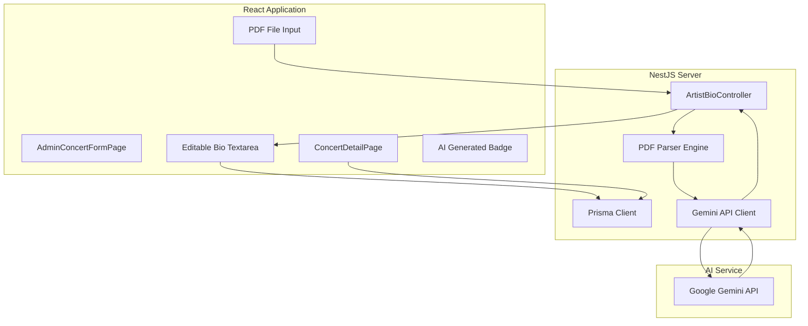
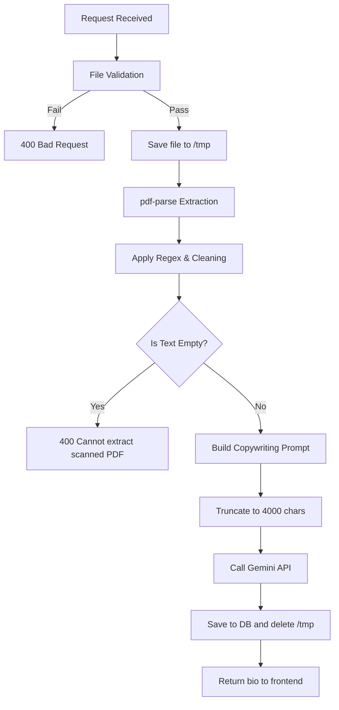

# Technical Design: AI Artist Bio Generator

## Component Architecture

The AI Artist Bio Generator integrates text extraction, natural language summarization, and manual content editing.



---

## Database Schema (Prisma)

The Prisma schema updates the existing `Concert` model to support text storage for the generated bio and the file name of the source PDF.

```prisma
model Concert {
  // Existing fields...
  id              String         @id @default(uuid())
  name            String
  artists         String[]
  venue           String
  dateTime        DateTime
  description     String         @db.Text
  posterUrl       String
  seatMapSvg      String         @db.Text
  status          ConcertStatus  @default(UPCOMING)
  createdAt       DateTime       @default(now())
  updatedAt       DateTime       @updatedAt

  // NEW FIELDS
  artistBio       String?        @db.Text
  artistBioSource String?        // Original PDF filename
  
  @@map("concerts")
}
```

---

## Backend Design (NestJS)

### 1. Module Configuration: `ArtistBioModule`
* Encapsulates `ArtistBioController` and `ArtistBioService`.
* Integrates with `PrismaService`.

### 2. Endpoints
* `POST /api/admin/concerts/:id/generate-bio`:
  * **Authorization**: Secured by `JwtAuthGuard` and `RolesGuard(UserRole.ORGANIZER)`.
  * **Content-Type**: `multipart/form-data`.
  * **Payload**: Extends NestJS `FileInterceptor` targeting key `file`.
  * **Response**: Returns `{ artistBio: string }`.

### 3. Processing Pipeline



* **Validation**: File size ceiling of 10MB; mime-type must resolve to `application/pdf`.
* **Temporary Storage**: Upload stored in transient `/tmp/` storage during parsing.
* **Extraction**: Executed via the `pdf-parse` package.
* **Cleaning Rules**:
  * Strip excessive whitespace, tabs, and line breaks.
  * Filter out page numbers using `/^\d+$/` on split lines.
  * Strip repeated headers and footers.
  * Truncate the payload to a maximum of 4000 characters before sending it to the model.
* **Gemini API Invocation**:
  * Instantiate the Google Generative AI SDK client using the server-side environment variable `GEMINI_API_KEY`.
  * Target model: `gemini-1.5-flash`.
  * Max output tokens: `300`.
  * System prompt structure:
    > "You are a concert marketing copywriter. Based on the following artist press kit, write a compelling 2-3 paragraph artist bio for a concert ticket page. Be engaging, highlight achievements and musical style. Content: {cleaned_text}"
* **Transient File Disposal**: The PDF file path in `/tmp` is deleted asynchronously using node `fs/promises` in a `finally` block to prevent space leaks.

---

## Frontend Design (React + Vite)

### 1. `AdminConcertFormPage` Integration
* Add a file upload widget limiting uploads to `application/pdf` format.
* Selecting a file automatically invokes `POST /api/admin/concerts/:id/generate-bio`.
* Render a loading spinner within the text area while processing.
* On successful resolution, fill in the bio input and show an **"AI Generated"** badge next to the input label.
* On error (timeout, scanned document, limit errors), show an error toast, and leave the textarea empty and editable.
* The bio text input container remains editable by the organizer at all times.

### 2. `ConcertDetailPage` Integration
* An Artist Biography section is rendered below the general details if `artistBio` is not null.
