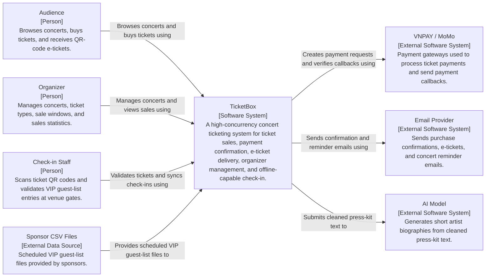
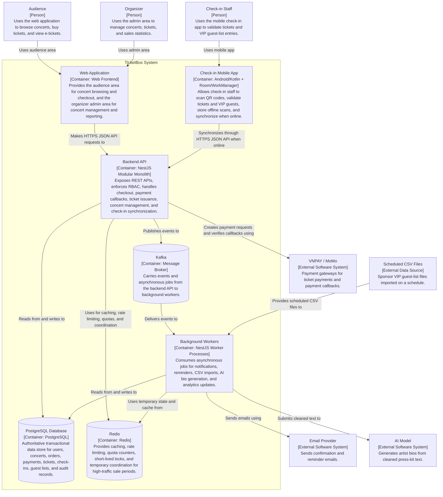
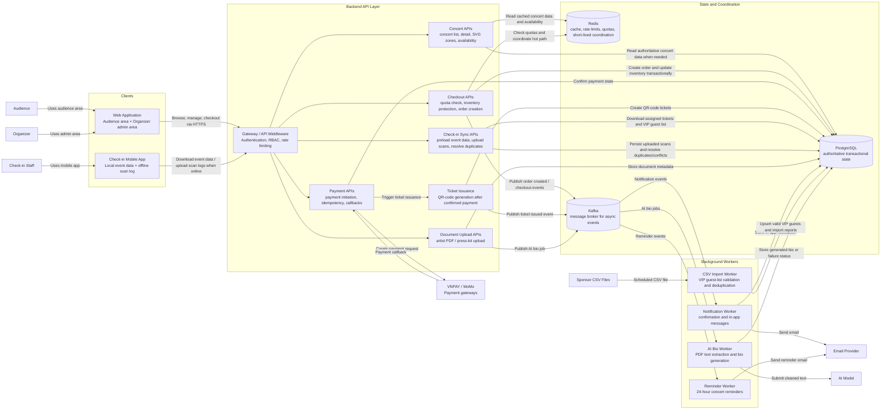
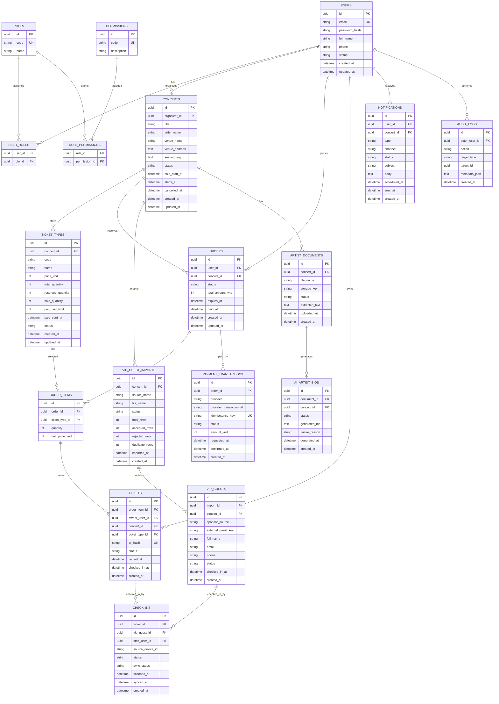

## Overall Architecture

TicketBox uses a combination of **Client-Server Architecture**, **Layered Architecture**, and **Event-driven Architecture**.

At the system level, TicketBox follows a **Client-Server Architecture**. Audience users, organizer users, and check-in staff use client applications to send requests to a centralized backend server. The system provides a web application with two role-based areas: a public audience area for concert browsing and ticket purchasing, and an organizer admin area for concert and ticket management. The mobile check-in app is used by staff at the venue gate. These clients communicate with the backend through HTTPS JSON APIs. This style is suitable because TicketBox needs centralized control over ticket inventory, payment state, user permissions, and check-in validation.

Inside the backend, TicketBox follows a **Layered Architecture**. The Presentation/API layer exposes REST endpoints and handles request validation, authentication, authorization, and rate limiting. The Business Logic layer implements core rules such as ticket availability checking, per-user purchase limits, order creation, payment confirmation, QR-code e-ticket issuance, notification triggering, and offline check-in synchronization. The Data Access layer encapsulates database access, transactions, locks, repositories, cache access, and message publishing. The Database layer stores authoritative data in PostgreSQL, while Redis supports caching, rate limiting, temporary coordination, and high-traffic protection.

TicketBox also applies **Event-driven Architecture** for slow or failure-prone workflows that should not block the main request path. After important state changes, such as successful payment, ticket issuance, PDF upload, or CSV file arrival, the backend publishes events to a message broker. Background workers consume these events to send notifications, schedule 24-hour reminders, process sponsor VIP CSV imports, generate AI artist bios, and update analytics projections. This reduces coupling between core ticket purchasing and asynchronous workflows, and allows failed tasks to be retried without blocking users from browsing or purchasing tickets.

The main runtime components are:

- Web Application: provides two role-based areas: an audience-facing area for concert browsing, seating-zone viewing, ticket availability, checkout, and QR-code e-ticket access; and an organizer admin area for concert management, ticket configuration, sale-window and per-user limit setup, artist document upload, VIP guest-list import, and sales reporting.
- Mobile Check-in App: allows check-in staff to scan ticket QR codes and validate VIP guest-list entries, including during weak or unavailable network conditions.
- Backend API Server: exposes APIs for clients, enforces RBAC, handles checkout, payment callbacks, ticket issuance, concert management, and check-in synchronization.
- Background Workers: process asynchronous jobs such as notifications, reminders, CSV imports, AI bio generation, and analytics updates.
- PostgreSQL Database: acts as the source of truth for users, concerts, ticket types, orders, payments, tickets, check-ins, guest lists, and audit records.
- Redis: supports rate limiting, caching, short-lived locks, quota counters, and temporary state needed for high-traffic sale periods.
- Message Broker: carries events from the backend to background workers for asynchronous processing.
- External Systems: VNPAY/MoMo for payment, an email provider for confirmations and reminders, an AI model for artist bio generation, and scheduled CSV files from sponsors for VIP guest lists.

The communication model is mostly request-response for user-facing operations and event-driven for asynchronous processing. Web and mobile clients call the Backend API through HTTPS. The Backend API reads and writes authoritative data in PostgreSQL, uses Redis for caching and traffic protection, and publishes events to the message broker. Workers consume events and interact with PostgreSQL, Redis, email, AI, and CSV sources as needed. Payment gateways communicate with TicketBox through payment creation requests and verified callbacks. The mobile check-in app can work offline by storing scan records locally and synchronizing them with the backend when connectivity is restored.

## C4 Diagram: Level 1 - System Context



## C4 Diagram: Level 2 - Container



## High-Level Architecture Diagram



## Database Design

TicketBox uses **PostgreSQL** as the authoritative transactional database. The system has several consistency-sensitive workflows: ticket inventory decrement, per-user purchase-limit enforcement, payment confirmation, QR-code ticket issuance, and check-in validation. PostgreSQL is suitable because it provides ACID transactions, row-level locking, foreign keys, unique constraints, and reliable state transitions for these workflows.

Redis is not treated as the source of truth. Redis may store temporary rate-limit counters, short-lived locks, quota counters, and cached read models, but PostgreSQL determines final ticket ownership, payment state, ticket validity, VIP guest validity, and check-in status.

### Core conventions

- All main tables use UUID primary keys.
- Main records include `created_at` and `updated_at`; `deleted_at` is used only where soft deletion is needed.
- High-contention inventory updates run inside explicit PostgreSQL transactions.
- Ticket inventory rows are locked before reservation, sale confirmation, or release.
- Payment attempts use idempotency keys to prevent duplicate payment creation.
- Provider transaction IDs are stored to make payment callback processing idempotent.
- QR payloads are signed by the backend; the database stores the QR hash and validation state.
- Redis caches can be invalidated or rebuilt from PostgreSQL.



### Key table groups

- **Identity and RBAC**: `users`, `roles`, `permissions`, `user_roles`, and `role_permissions` support the three user groups: Audience, Organizer, and Check-in Staff.
- **Concert and ticket configuration**: `concerts` stores concert metadata, artist and venue information, sale timing, status, and SVG seating map. `ticket_types` stores zone-based ticket classes such as GA, SVIP, VIP, CAT1, and CAT2, including price, capacity, sale window, and per-user limit.
- **Purchase and inventory**: `orders` and `order_items` represent purchase intent. `ticket_types.reserved_quantity` is used for pending checkout/payment reservations, while `sold_quantity` represents successfully paid tickets. Final availability is derived from `total_quantity - reserved_quantity - sold_quantity`.
- **Payment**: `payment_transactions` records VNPAY/MoMo attempts, idempotency keys, provider transaction IDs, amounts, and final payment status. Payment callbacks update the order state only through idempotent state transitions.
- **Ticketing**: `tickets` are issued only after successful payment confirmation. Each ticket has a unique `qr_hash`, owner, ticket type, status, and check-in state.
- **Check-in**: `check_ins` records venue gate scans. A check-in record may reference either a normal ticket or a VIP guest-list entry. Offline-origin scans include device ID, scanned time, sync status, and conflict result.
- **VIP guest-list import**: `vip_guest_imports` records each scheduled CSV import. `vip_guests` stores accepted sponsor guest entries after validation and deduplication.
- **AI artist bio**: `artist_documents` stores uploaded PDFs or press kits and extraction status. `ai_artist_bios` stores generated bio output, generation status, and failure reason when extraction or AI generation fails.
- **Notifications**: `notifications` stores in-app notifications and scheduled email jobs for purchase confirmations and 24-hour reminders.
- **Audit logs**: `audit_logs` records sensitive operations such as concert cancellation, ticket-type changes, CSV imports, payment state changes, and check-in conflict resolution.

### Important constraints and indexes

- `users.email` must be unique.
- `ticket_types` has unique `(concert_id, code)`.
- `ticket_types.sold_quantity + ticket_types.reserved_quantity` must not exceed `total_quantity`.
- `orders` should be indexed by `(user_id, concert_id, status)` and `(concert_id, status)`.
- `order_items` should be indexed by `(ticket_type_id)`.
- Per-user purchase limits are enforced by checking paid orders and issued tickets for `(user_id, concert_id, ticket_type_id)`.
- `payment_transactions.idempotency_key` must be unique.
- `payment_transactions` should have a unique nullable `(provider, provider_transaction_id)` to handle repeated provider callbacks.
- `tickets.qr_hash` must be unique.
- `tickets` should be indexed by `(concert_id, ticket_type_id, status)`.
- `check_ins` must allow at most one successful check-in per `ticket_id`.
- `check_ins` must allow at most one successful check-in per `vip_guest_id`.
- `check_ins` should be indexed by `(source_device_id, sync_status)` for mobile synchronization.
- `vip_guests` should be unique by `(concert_id, sponsor_source, external_guest_key)` when an external key is available.
- When no external guest key is available, duplicate detection should use normalized name, email, and phone.
- `notifications` should be indexed by `(user_id, status)` and `(scheduled_at, status)`.
- `audit_logs` should be indexed by `(actor_user_id, created_at)` and `(target_type, target_id)`.

## Access Control Design (RBAC)

TicketBox uses role-based access control with ownership and assignment checks. RBAC is enforced at the API boundary by NestJS guards and checked again inside domain services for ownership-sensitive operations. Tokens identify the authenticated user and may include role hints for UI or routing purposes, but final authorization decisions use server-side role and permission records.

Published concert list and concert detail pages are publicly readable. Purchase actions, ticket access, organizer administration, payment-related operations, and check-in synchronization require authentication.

| Capability                                                | Audience         | Organizer                               | Check-in Staff                      |
| --------------------------------------------------------- | ---------------- | --------------------------------------- | ----------------------------------- |
| Browse published concerts and availability                | Allowed          | Allowed                                 | Optional read-only                  |
| View concert detail and seating map                       | Allowed          | Allowed                                 | Optional read-only                  |
| Purchase tickets                                          | Allowed          | Allowed only if also acting as Audience | Denied                              |
| View own tickets                                          | Allowed if owner | Allowed if owner                        | Denied                              |
| Create/update/cancel concerts                             | Denied           | Allowed for owned concerts              | Denied                              |
| Configure ticket types, sale windows, and per-user limits | Denied           | Allowed for owned concerts              | Denied                              |
| View sales/revenue statistics                             | Denied           | Allowed for owned concerts              | Denied                              |
| Upload artist PDFs or press kits                          | Denied           | Allowed for owned concerts              | Denied                              |
| View AI bio processing status                             | Denied           | Allowed for owned concerts              | Denied                              |
| Review VIP CSV import results                             | Denied           | Allowed for owned concerts              | Denied                              |
| Scan ticket QR codes and validate VIP guest-list entries  | Denied           | Denied by default                       | Allowed for assigned concerts/gates |
| Synchronize offline check-ins                             | Denied           | Denied by default                       | Allowed for assigned concerts/gates |

Access-control rules:

- Public concert browsing endpoints expose only published concert data and do not expose organizer-only fields.
- Audience ticket APIs are scoped by `ticket.owner_user_id`; a user can only view their own tickets.
- Organizer APIs are scoped by `concert.organizer_id`; an organizer cannot manage concerts owned by another organizer.
- Check-in staff APIs are scoped by assigned concert IDs or gate assignments; staff cannot access purchase, payment, organizer management, or revenue APIs.
- Web admin routes require organizer permissions; mobile scan and sync routes require check-in permissions.
- API guards perform authentication, role, and permission checks before entering business logic.
- Domain services repeat ownership or assignment checks before sensitive state changes such as concert cancellation, ticket-type quantity changes, CSV import review, payment state changes, and check-in conflict resolution.
- Sensitive operations are written to audit logs with actor, action, target, timestamp, and relevant metadata.

## Protection Mechanism Design

### Traffic Spike Control

TicketBox limits excessive traffic before requests reach expensive business logic such as inventory locking, order creation, or payment initiation.

- Redis-backed rate limiting runs in the NestJS gateway/middleware layer.
- The primary algorithm is token bucket for checkout and payment initiation APIs, because it allows short bursts but still limits sustained abuse.
- Fixed-window limits may be used for simpler public browsing APIs.
- Rate-limit dimensions include IP address, authenticated user ID, device ID, endpoint group, and concert ID during sale windows.
- Checkout and payment-initiation endpoints use stricter limits than browsing endpoints.
- Requests that exceed limits receive HTTP `429 Too Many Requests` with retry metadata.
- Bot-like repeated requests may receive a short Redis-backed cooldown.
- High-read concert pages use Redis cache-aside reads so traffic spikes do not directly become PostgreSQL read spikes.
- Kafka is used for non-critical fan-out work such as notifications, reminders, CSV imports, AI jobs, and analytics updates.

Example configurable limits:

| Endpoint group          |                          Example limit | Behavior when exceeded                 |
| ----------------------- | -------------------------------------: | -------------------------------------- |
| Public concert browsing |              60 requests/minute per IP | Return 429 with retry time             |
| Authenticated user APIs |           120 requests/minute per user | Return 429 with retry time             |
| Checkout attempts       | 5 requests/minute per user per concert | Return 429 and short cooldown          |
| Payment initiation      |   3 requests/minute per user per order | Return existing payment attempt or 429 |
| Mobile check-in sync    |          30 requests/minute per device | Return 429 and retry later             |

Payment callbacks are not protected by normal user rate limits. They must pass provider signature verification and may be restricted by provider-specific network rules in deployment.

### Ticket Inventory and Per-user Quota Protection

TicketBox protects limited ticket inventory and organizer-configured per-user limits using both fast Redis coordination and authoritative PostgreSQL transactions.

Purchase flow:

1. Gateway rate limit allows the request.
2. Redis performs a fast quota pre-check for the user, concert, ticket type, and requested quantity.
3. A short-lived Redis lock coordinates high-contention access to the same ticket type.
4. A PostgreSQL transaction locks the target `ticket_types` row before updating reserved or sold quantities.
5. The service checks remaining capacity and the user's already paid or issued quantity from PostgreSQL.
6. If the request is valid, the system creates the order and order items, then reserves inventory for the pending payment period.
7. If payment succeeds, reserved inventory becomes sold inventory and QR-code tickets are issued.
8. If the order expires or payment fails, reserved inventory is released.
9. Redis availability cache and quota counters are adjusted or invalidated after inventory-changing events.

PostgreSQL remains the final authority for inventory and per-user purchase limits. Redis counters and locks only protect hot paths and reduce unnecessary database contention.

### Payment Gateway Failure Handling

VNPAY and MoMo are integrated through provider adapters so gateway failures are isolated from browsing, concert detail, check-in, and other non-payment features.

Each payment provider has a circuit breaker with three states:

| State     | Meaning                          | Behavior                                            |
| --------- | -------------------------------- | --------------------------------------------------- |
| Closed    | Provider is considered healthy   | Payment requests are sent normally                  |
| Open      | Provider is considered unhealthy | New payment initiation is blocked for that provider |
| Half-Open | System is testing recovery       | A limited test request is allowed                   |

Example trigger thresholds:

- Open the circuit after 5 consecutive timeout/network failures.
- Open the circuit if more than 50% of the last 20 payment initiation attempts fail.
- Keep the circuit open for 60 seconds before moving to Half-Open.
- In Half-Open, allow one test request. If it succeeds, close the circuit; otherwise open it again.

Failure behavior:

- If one provider is unavailable, checkout may offer the other provider.
- If both providers are unavailable, payment initiation returns a controlled unavailable response.
- Users can still browse concerts, view concert details, and view ticket availability.
- Payment callbacks are still accepted and verified even if new payment initiation is disabled.
- Expired unpaid orders release reserved inventory through a scheduled worker.

### Double-charge Prevention

Each payment initiation uses an idempotency key for a specific user, order, provider, and amount.

Storage:

- PostgreSQL stores the authoritative idempotency record in `payment_transactions.idempotency_key`.
- PostgreSQL also stores provider transaction IDs with a unique nullable `(provider, provider_transaction_id)` constraint.
- Redis may cache idempotency responses for a short TTL, such as 15 minutes, to quickly return repeated payment initiation results.

Duplicate handling flow:

1. The client or server provides an idempotency key when initiating payment.
2. If the idempotency key is new, TicketBox creates one `payment_transactions` record.
3. If the same key is reused with the same order, provider, and amount, TicketBox returns the existing payment transaction state.
4. If the same key is reused with a different order, provider, or amount, TicketBox rejects the request with HTTP `409 Conflict`.
5. If a provider callback is repeated, TicketBox detects the existing `(provider, provider_transaction_id)` or already-final order state.
6. Repeated callbacks do not create another paid order and do not issue duplicate tickets.

Order state transitions are monotonic:

```text
pending_payment -> paid -> tickets_issued
pending_payment -> expired
pending_payment -> cancelled
```

QR-code tickets are issued only after verified payment confirmation. Client-side payment redirects alone are never used as proof of payment.

### Caching

TicketBox uses Redis with the cache-aside strategy for high-read data. PostgreSQL remains the source of truth, and checkout always validates inventory and quota against PostgreSQL before final state changes.

| Cached object              | Strategy                        |   Example TTL | Invalidation                                                            |
| -------------------------- | ------------------------------- | ------------: | ----------------------------------------------------------------------- |
| Concert list               | Cache-aside                     |    60 seconds | Concert create/update/cancel                                            |
| Concert detail             | Cache-aside                     |     5 minutes | Concert update/cancel or published version change                       |
| SVG seating map            | Cache-aside + version key       |    30 minutes | Seating map or ticket type change                                       |
| Ticket availability        | Cache-aside / active adjustment |   3–5 seconds | Payment success, reservation expiry, ticket release, ticket type change |
| Organizer sales statistics | Cache-aside projection          | 30–60 seconds | Payment success, ticket issuance, cancellation                          |

Caching rules:

- Public pages may show approximate remaining ticket counts.
- Checkout never trusts cached availability for final purchase decisions.
- Successful payment, reservation expiration, and ticket release update or invalidate availability keys.
- Concert metadata caches use longer TTLs because the data changes less frequently.
- Ticket availability caches use short TTLs because the data changes during sale windows.
- Cache misses rebuild data from PostgreSQL and repopulate Redis.

### Offline Check-in Protection

The mobile check-in app must continue working under weak or unavailable network conditions without losing scan records.

- Before or during an event, the mobile app downloads assigned ticket and VIP guest-list data for the concerts or gates it is allowed to check.
- The app stores this data and local scan logs in local storage.
- When offline, scans are validated against local data and written to a durable local scan log.
- The app detects duplicate scans on the same device immediately.
- When connectivity returns, the app uploads pending scan logs to the check-in sync API.
- The backend stores accepted check-ins in PostgreSQL.
- PostgreSQL enforces at most one successful check-in per ticket or VIP guest-list entry.
- If two devices scanned the same ticket offline, the first valid synchronized scan wins; later scans are marked as duplicate or conflict.

## Architecture Decision Records (ADR)

### ADR 1 — Use a hybrid Client-Server, Layered, and Event-driven Architecture

**Decision:** TicketBox uses Client-Server Architecture at the system level, Layered Architecture inside the backend, and Event-driven Architecture for asynchronous workflows.

**Rationale:** TicketBox needs centralized control over ticket inventory, payment state, user permissions, and check-in validation, so Client-Server is appropriate. The backend contains multiple business domains, so Layered Architecture improves separation of concerns, maintainability, and testability. Notifications, reminders, CSV imports, AI bio generation, and analytics should not block the main purchase flow, so Event-driven Architecture is used for those workflows.

**Trade-offs:** This hybrid style is more complex than a simple layered web application because it requires a message broker and background workers. However, it improves scalability and fault isolation for slow or failure-prone tasks.

---

### ADR 2 — Use a modular monolith instead of microservices for the backend

**Decision:** The backend is implemented as a NestJS modular monolith.

**Rationale:** Core workflows such as checkout, inventory update, per-user quota enforcement, payment confirmation, ticket issuance, and check-in validation require coordinated state changes over shared transactional data. Keeping these core domains in one backend reduces distributed transaction complexity while still allowing clear module boundaries.

**Trade-offs:** A modular monolith can become tightly coupled if module boundaries are not enforced. Future extraction into separate services may be needed if team ownership or deployment scale grows.

---

### ADR 3 — Use PostgreSQL as the authoritative database

**Decision:** PostgreSQL is used as the system of record for users, concerts, ticket types, orders, payments, tickets, check-ins, guest lists, AI processing status, notifications, and audit logs.

**Rationale:** TicketBox requires strong consistency for ticket inventory, per-user purchase limits, payment state, ticket issuance, and check-in validation. PostgreSQL provides ACID transactions, foreign keys, unique constraints, indexes, and row-level locking.

**Trade-offs:** PostgreSQL can become a bottleneck under high read traffic if every public page request queries it directly. TicketBox mitigates this with Redis caching and careful transaction boundaries.

---

### ADR 4 — Use Redis for caching, rate limiting, quotas, and short-lived coordination

**Decision:** Redis is used for public read caches, rate limiting, short-lived locks, quota pre-check counters, and temporary coordination state.

**Rationale:** TicketBox has read-heavy concert pages and high-contention sale windows. Redis provides low-latency access for data that does not need to be the source of truth, reducing PostgreSQL load and protecting hot paths before expensive business logic runs.

**Trade-offs:** Redis data may be stale or lost, so it must not be the final authority for ticket ownership, payment state, or check-in validity. PostgreSQL remains the source of truth.

---

### ADR 5 — Use Kafka as the message broker for asynchronous workflows

**Decision:** Kafka is used as the message broker between the Backend API and background workers.

**Rationale:** TicketBox has several slow or failure-prone workflows: email notifications, 24-hour reminders, sponsor CSV imports, AI artist-bio generation, and analytics projection updates. Kafka decouples these workflows from synchronous checkout and browsing requests, supports retryable processing, and allows adding new consumers later.

**Trade-offs:** Kafka adds operational complexity compared with direct synchronous calls or an in-process queue. For this design, the benefit is clearer event-driven architecture and better isolation of asynchronous work.

---

### ADR 6 — Use pessimistic locking for high-contention ticket inventory

**Decision:** Ticket inventory updates use PostgreSQL transactions and row-level locks on ticket type inventory rows during reservation, sale confirmation, and release.

**Rationale:** Popular ticket classes such as SVIP may have very limited capacity and very high concurrent demand. Pessimistic locking prevents two concurrent transactions from assigning the same final ticket capacity.

**Trade-offs:** Pessimistic locking can reduce throughput and increase wait time under heavy contention. Redis rate limiting and short-lived coordination reduce unnecessary database contention before requests reach the critical transaction.

---

### ADR 7 — Use token-based authentication with server-side authorization checks

**Decision:** Clients authenticate with tokens, while final authorization uses server-side role, permission, ownership, and assignment checks.

**Rationale:** TicketBox has three user groups: Audience, Organizer, and Check-in Staff. Some permissions depend not only on role but also on ownership or assignment, such as an organizer managing only their own concerts or check-in staff syncing only assigned event gates.

**Trade-offs:** Server-side permission checks add database or cache lookups, but they prevent stale client claims from granting unauthorized access.

---

### ADR 8 — Use local mobile storage for offline check-in

**Decision:** The check-in mobile app stores assigned ticket and VIP guest-list data, plus offline scan logs, in local device storage such as SQLite or WatermelonDB.

**Rationale:** Venue network connectivity can be weak or unavailable. Local storage allows staff to continue validating tickets and guest-list entries, then synchronize scan logs when connectivity returns.

**Trade-offs:** Offline validation can create conflicts if two devices scan the same ticket before synchronization. The backend resolves conflicts with a first-valid-sync-wins rule and unique successful check-in constraints.

---

### ADR 9 — Use provider adapters and idempotency for payment integration

**Decision:** VNPAY and MoMo are integrated through provider adapters, and all payment attempts use idempotency keys and provider transaction reconciliation.

**Rationale:** Payment gateways may timeout, fail, or send repeated callbacks. Provider adapters isolate gateway-specific logic, while idempotency prevents duplicate payment transactions and duplicate ticket issuance.

**Trade-offs:** Payment state management becomes more complex because orders, payment transactions, and tickets must follow explicit state transitions. This complexity is necessary to avoid double charges and missing tickets.

---

### ADR 10 — Use cache-aside for public concert data

**Decision:** TicketBox uses cache-aside caching for concert lists, concert details, SVG seating maps, ticket availability, and organizer statistics projections.

**Rationale:** Public concert pages are read frequently, especially during sale windows. Cache-aside reduces direct PostgreSQL load while still allowing PostgreSQL to remain the authoritative data source.

**Trade-offs:** Cached data may be temporarily stale, especially ticket availability. Checkout never trusts cached availability for final purchase decisions and always validates against PostgreSQL.
