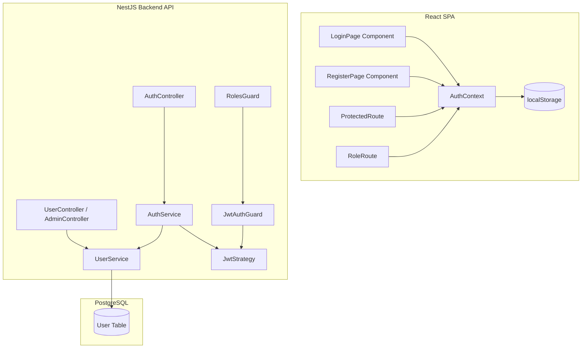

# Technical Design: Authentication and Role-Based Access Control

## Component Architecture

Authentication and RBAC are implemented uniformly across the NestJS backend API and the React single-page frontend.



---

## Database Schema (Prisma)

The Prisma schema defines the `User` model with a PostgreSQL native Enum representing the three fixed roles: `AUDIENCE`, `ORGANIZER`, and `STAFF`.

```prisma
model User {
  id           String     @id @default(uuid())
  email        String     @unique
  passwordHash String     @map("password_hash")
  role         UserRole   @default(AUDIENCE)
  createdAt    DateTime   @default(now()) @map("created_at")
  updatedAt    DateTime   @updatedAt @map("updated_at")

  @@map("users")
}

enum UserRole {
  AUDIENCE
  ORGANIZER
  STAFF
}
```

---

## Backend Design (NestJS)

### 1. Modules
* **UsersModule**: Exports `UserService` to interact with user profiles in the database.
* **AuthModule**: Manages login, registration, password hashing via bcrypt, token generation, and defines passport strategies.

### 2. Endpoints
* `POST /api/auth/register` (Public):
  * Accepts email and password.
  * Hashes password with bcrypt (salt rounds: 10).
  * Creates a new user record in PostgreSQL with role `AUDIENCE`.
* `POST /api/auth/login` (Public):
  * Accepts email and password.
  * Validates credentials, returns JWT string: `{ token: "..." }`.
* `GET /api/auth/me` (Protected):
  * Validates the bearer token using `JwtAuthGuard`.
  * Returns user fields (excluding `passwordHash`).
* `POST /api/admin/staff` (Protected - Organizer Only):
  * Accepts email and password for a staff member.
  * Creates a new user in PostgreSQL with role `STAFF`.
  * Guarded by `JwtAuthGuard` and `RolesGuard(UserRole.ORGANIZER)`.

### 3. JWT Verification & Guards
* **JWT Payload**:
  ```json
  {
    "sub": "user-uuid",
    "email": "user@example.com",
    "role": "ORGANIZER"
  }
  ```
* **JwtAuthGuard**:
  * Extends NestJS `@nestjs/passport` authentication guard using the `jwt` strategy.
  * Extracts JWT from the request authorization headers (`Bearer <token>`).
  * If valid, populates `request.user` with payload fields.
* **RolesGuard**:
  * Implements `CanActivate`.
  * Evaluates roles set by the `@Roles()` decorator.
  * Compares decorator roles against `request.user.role`.
* **Roles Decorator**:
  * Set metadata key `roles` containing the permitted `UserRole` values.
  * Custom helper: `@Roles(UserRole.ORGANIZER)`.

---

## Frontend Design (React + Vite)

### 1. AuthContext
State provider wrapping the React tree.
* **State variables**:
  * `user`: `{ id: string, email: string, role: 'AUDIENCE' | 'ORGANIZER' | 'STAFF' } | null`
  * `token`: `string | null`
  * `isAuthenticated`: `boolean`
  * `isLoading`: `boolean`
* **Methods**:
  * `login(email, password)`: Submits details, saves token to `localStorage`, decodes role/email, sets user state.
  * `logout()`: Clears token from `localStorage`, resets state to null, redirects to `/login`.
  * `register(email, password)`: Submits details to register.

### 2. Route Protection Components
* **ProtectedRoute**:
  * Checks if `isAuthenticated` is true. If false (and `isLoading` is false), redirects to `/login`.
* **RoleRoute**:
  * Wraps protected children.
  * Asserts `user.role` matches one of the allowed roles. If false, redirects the user to `/403` or `/concerts` with a warning.

---

## Seed Data Configuration

A database seed script must generate the following standard accounts for development and testing:

| Email | Password | Role |
| :--- | :--- | :--- |
| `organizer@ticketbox.vn` | `Organizer@123` | `ORGANIZER` |
| `staff@ticketbox.vn` | `Staff@123` | `STAFF` |
| `alice@example.com` | `Audience@123` | `AUDIENCE` |
| `bob@example.com` | `Audience@123` | `AUDIENCE` |
| `carol@example.com` | `Audience@123` | `AUDIENCE` |
