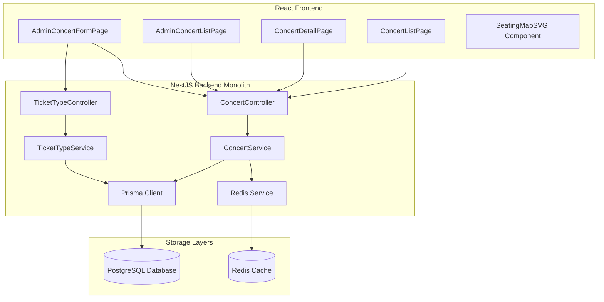

# Technical Design: Concert Management

## Component Architecture

Concert Management is divided into a backend API layer built with NestJS and a frontend single-page application built with React, Vite, and TailwindCSS.



---

## Database Schema (Prisma)

The Prisma schema will include models for `Concert` and `TicketType`.

```prisma
model Concert {
  id           String       @id @default(uuid())
  name         String
  artists      String[]
  venue        String
  dateTime     DateTime
  description  String       @db.Text
  posterUrl    String
  seatMapSvg   String       @db.Text
  status       ConcertStatus @default(UPCOMING)
  ticketTypes  TicketType[]
  createdAt    DateTime     @default(now())
  updatedAt    DateTime     @updatedAt

  @@map("concerts")
}

model TicketType {
  id            String    @id @default(uuid())
  concertId     String
  concert       Concert   @relation(fields: [concertId], references: [id], onDelete: Cascade)
  name          String    // e.g. "GA", "VIP", "SVIP", "CAT1", "CAT2"
  price         Int       // Price in VND
  totalQuantity Int
  soldQuantity  Int       @default(0)
  saleStartTime DateTime
  maxPerAccount Int
  createdAt     DateTime  @default(now())

  @@unique([concertId, name])
  @@map("ticket_types")
}

enum ConcertStatus {
  UPCOMING
  ONGOING
  CANCELLED
}
```

---

## Backend Design (NestJS)

### 1. Module Structure
* **ConcertModule**: Encapsulates `ConcertController`, `ConcertService`, and database dependencies.
* **TicketTypeModule**: Encapsulates `TicketTypeController` and `TicketTypeService`.

### 2. REST Endpoints

#### Public
* `GET /api/concerts`:
  * Returns an array of upcoming concerts (`status: UPCOMING` or `ONGOING`).
  * Enforces a 5-minute cache TTL via Redis (Key: `concerts:list`).
* `GET /api/concerts/:id`:
  * Returns concert detail + list of ticket types + real-time remaining ticket counts.
  * Static details are cached in Redis for 5 minutes (Key: `concerts:{id}`).
  * Remaining tickets per zone are fetched from Redis or DB with a 30s TTL (Key: `concerts:{id}:tickets`).

#### Organizer Only (Guarded)
* `POST /api/concerts`: Create a new concert.
  * Invalidates `concerts:list`.
* `PUT /api/concerts/:id`: Update concert details.
  * Invalidates `concerts:list` and `concerts:{id}`.
* `DELETE /api/concerts/:id`: Cancel a concert (sets status to `CANCELLED`).
  * Invalidates `concerts:list` and `concerts:{id}`.
* `GET /api/concerts/:id/stats`:
  * Returns tickets sold and total revenue per ticket type.
  * Non-cached, direct DB queries.

---

## Caching Strategy (Redis)

To protect the database during ticket sale spikes, we apply three caching tiers:

1. **Concert List Cache**:
   * Key: `concerts:list`
   * TTL: 5 minutes
   * Invalidation: On any create/update/cancel.
2. **Concert Detail Cache**:
   * Key: `concerts:{id}`
   * TTL: 5 minutes (contains static text, artists, description, and SVG seating map).
   * Invalidation: On any edit or cancellation.
3. **Ticket Availability Cache**:
   * Key: `concerts:{id}:tickets`
   * TTL: 30 seconds
   * Value: Array of `{ ticketTypeId: string, name: string, remaining: number }`
   * Invalidation: Cleaned on successful order purchase event or ticket cancellation.

---

## Frontend Design (React + Vite)

### 1. Routes
* `/concerts`: `ConcertListPage` (Grid format with cards showing poster, venue, date, name, and artists).
* `/concerts/:id`: `ConcertDetailPage` (Split layout: Left = Static details & Interactive SVG seat map, Right = Ticket configurations, countdowns, remaining inventory, and actions).
* `/admin/concerts`: `AdminConcertListPage` (List of concerts owned by Organizer with management actions).
* `/admin/concerts/new`: `AdminConcertFormPage` (Form to create concert details and define initial ticket types).
* `/admin/concerts/:id/edit`: `AdminConcertFormPage` (Form to edit concert metadata and view statistics).

### 2. Interactive SVG Seating Map
* The seat map is rendered inline using the `seatMapSvg` property from the database.
* Elements inside the SVG must have class identifiers matching ticket type names (`GA`, `VIP`, `SVIP`, `CAT1`, `CAT2`).
* When a user hovers over a zone in the SVG, that zone is highlighted. Clicking a zone selects the corresponding ticket type on the purchase panel.
* If a zone is sold out, the corresponding SVG element is colored gray, and clicking it does nothing.

### 3. Status Badges and Purchase States
* **Upcoming & Sale Not Started**: Shows a countdown timer displaying days, hours, minutes, and seconds until the sale window opens.
* **On Sale**: Shows a "Buy Ticket" button.
* **Zone Sold Out**: Displays a grayed-out ticket selection option and a "Sold Out" tag.
* **Cancelled**: A large red notification banner is pinned to the top of the detail page, disabling all ticket selection options.
