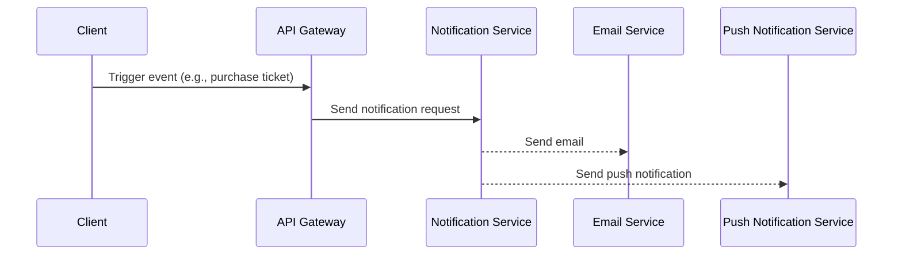

# Design: Notification Service

This document outlines the technical design for the notification service.

## 1. Architecture

The notification service will be a microservice built with NestJS. It will expose a REST API for other services to send notifications.



## 2. API Specification

The notification service will expose the following endpoint:

- `POST /notifications`

**Request Body:**

```json
{
  "userId": "string",
  "type": "string", // e.g., "ticket_purchase", "event_reminder"
  "data": {
    // event-specific data
  }
}
```

## 3. Database Schema

The notification service will not have its own database. It will be a stateless service.

## 4. Integrations

- **Email Service:** The service will integrate with an email provider (e.g., SendGrid, Mailgun) to send emails.
- **Push Notification Service:** The service will integrate with a push notification provider (e.g., Firebase Cloud Messaging) to send push notifications.
